```{r setup, echo=FALSE, results="hide"}
knitr::opts_chunk$set(
  tidy=FALSE, cache=TRUE,
  dev="png",
  message=FALSE, error=FALSE, warning=TRUE
)
```

## Browse TFregulome Database

TFregulomeR allows users to easily browse the TFregulome database using only one simple
function `TFBSBrowser`. One can search the database according to species, organ, sample type,
cell/tissue name, TF name, disease state, and source. A data.frame will be returned upon
searching, including information in TFregulome ID (important for following analysis), species, 
organ, sample type, cell/tissue name, description of cell/tissue, disease state, TF name, 
source, TF source ID, number of peaks, and number of peaks with motif. In particular, if 
no input is given for the function, all records in TFregulome database will be returned.

```{r eval=FALSE}
library(TFregulomeR)
# browse all records in TFregulome database
all_record <- TFBSBrowser()
#> 1376 TFBS(s) founded: ...
#> ... covering 374 TF(s)
#> ... from 1 species:
#> ... ...human
#> ... from 29 organ(s):
#> ... ... stem_cell, blood_and_lymph, connective_tissue, colorectum, brain, bone, stomach, 
#> prostate, breast, pancreas, skin, kidney, lung, eye, esophagus, heart, muscle, uterus, 
#> spleen, cervix, testis, liver, adrenal_gland, neck_and_mouth, pleura, ovary, thymus, 
#> fallopian, vagina
#> ... in 3 sample type(s):
#> ... ... primary_cells, cell_line, tissue
#> ... in  423  different cell(s) or tissue(s)
#> ... in 8 type(s) of disease state(s):
#> ... ... normal, tumor, Simpson_Golabi_Behmel_syndrome, progeria, metaplasia, unknown, 
#> immortalized, premetastatic
#> ... from the source(s): GTRD, MethMotif

# returned table
head(all_record)
#>                                               ID species             organ
#> 1 GTRD-EXP000061_HSA_embryonic-stem-cells_PRDM14   human         stem_cell
#> 2          GTRD-EXP000080_HSA_CD4pos-T-cells_YY1   human   blood_and_lymph
#> 3                 GTRD-EXP000128_HSA_EWS502_FLI1   human connective_tissue
#> 4                  GTRD-EXP000132_HSA_HUVEC_FLI1   human connective_tissue
#> 5                GTRD-EXP000140_HSA_LS180_TCF7L2   human        colorectum
#> 6                 GTRD-EXP000142_HSA_LS180_CEBPB   human        colorectum
#>     sample_type     cell_tissue_name                      description
#> 1 primary_cells embryonic stem cells             embryonic stem cells
#> 2 primary_cells         CD4+ T-cells                     CD4+ T-cells
#> 3     cell_line               EWS502                    Ewing sarcoma
#> 4     cell_line                HUVEC umbilical vein endothelial cells
#> 5     cell_line                LS180                     colon cancer
#> 6     cell_line                LS180                     colon cancer
#>   disease_state     TF source source_ID peak_num peak_with_motif_num
#> 1        normal PRDM14   GTRD EXP000061    17482                5656
#> 2        normal    YY1   GTRD EXP000080    18298                2038
#> 3         tumor   FLI1   GTRD EXP000128    89523               28914
#> 4        normal   FLI1   GTRD EXP000132    71437               36126
#> 5         tumor TCF7L2   GTRD EXP000140    16517                2312
#> 6         tumor  CEBPB   GTRD EXP000142   128542               67747

# browse TFBSs in blood and lymph
blood_and_lymph_record <- TFBSBrowser(organ = "blood_and_lymph")
#> 458 TFBS(s) founded: ...
#> ... covering 172 TF(s)
#> ... from 1 species:
#> ... ...human
#> ... from 1 organ(s):
#> ... ... blood_and_lymph
#> ... in 3 sample type(s):
#> ... ... primary_cells, cell_line, tissue
#> ... in  129  different cell(s) or tissue(s)
#> ... in 2 type(s) of disease state(s):
#> ... ... normal, tumor
#> ... from the source(s): GTRD, MethMotif

# browse all CEBPB TFBSs
CEBPB_record <- TFBSBrowser(tf = "CEBPB")
#> 16 TFBS(s) founded: ...
#> ... covering 1 TF(s)
#> ... from 1 species:
#> ... ...human
#> ... from 9 organ(s):
#> ... ... colorectum, uterus, blood_and_lymph, stem_cell, bone, lung, cervix, liver, 
#> breast
#> ... in 2 sample type(s):
#> ... ... cell_line, primary_cells
#> ... in  16  different cell(s) or tissue(s)
#> ... in 2 type(s) of disease state(s):
#> ... ... tumor, normal
#> ... from the source(s): GTRD, MethMotif
```

## Retrieve datasets from TFregulome database

We have designed some useful functions to aid in data retrival from TFregulome database. 
Retrival of motif matrix (and DNA methylation matrix if the source is MethMotif) can be achieved 
using `searchMotif`. Further those obtained matrices can be easily saved locally using `exportMMPFM`,
and corresponding (Meth)Motif logo (MethMotif logo if DNA methylation matrix or beta score 
matrix is available)can be simply plotted using `plotLogo`. Here, we introduced an object of class 
"MethMotif" using S4 class in order for an easy and intuitive storage, manipulation and conversion 
(with other packages such as "TFBSTools") of a MethMotif matrix, which is a combination of a TF 
motif weight position matrix and, if available, its DNA methylation matrix (beta score matrix). 
To obtain the element or slot from an S4 obejct, one can simply use `@` to retrive it from class 
"MethMotif". What's more, we allow users to directly load peak regions of TF of interest 
(all peaks or peaks with motif only) from TFregulome database using `loadPeaks`.

```{r eval=FALSE}
# according to TFBSBrowser results for all CEBPB TFBSs, we select two CEBPB TFBSs 
# from MethMotif and GTRD: MM1_HSA_K562_CEBPB, GTRD-EXP040801_HSA_HL-60_CEBPB

# loading MethMotif object in "MEME" format. Currently we support "MEME" and "TRANSFAC".
K562_CEBPB <- searchMotif(id = "MM1_HSA_K562_CEBPB", motif_format = "MEME")
#> There are a matched record exported in a MethMotif object.
HL60_CEBPB <- searchMotif(id = "GTRD-EXP040801_HSA_HL-60_CEBPB", motif_format = "MEME")
#> There are a matched record exported in a MethMotif object.
K562_CEBPB_MM <- K562_CEBPB$MM1_HSA_K562_CEBPB
class(K562_CEBPB)
#> [1] "MethMotif"
#> attr(,"package")
#> [1] "TFregulomeR"

# get beta score matrix from MM1_HSA_K562_CEBPB since it's from MethMotif
K562_CEBPB_betaScore <- K562_CEBPB@MMBetaScore
K562_CEBPB_betaScore
#>      [,1] [,2] [,3] [,4] [,5] [,6] [,7] [,8] [,9] [,10] [,11]
#> [1,]   35    0    0    0    0  503    0    0    0     0    31
#> [2,]   18    0    0    0    0  797    0    0    0     0    22
#> [3,]    3    0    0    0    0  739    0    0    0     0     0

# no beta score matrix from GTRD-EXP040801_HSA_HL-60_CEBPB since it's from GTRD
HL60_CEBPB_betaScore <- HL60_CEBPB@MMBetaScore
HL60_CEBPB_betaScore
#>      [,1]
#> [1,]   NA

# get motif postion weight matrix
# the output is an S4 object named as 'MMmotif'
K562_CEBPB_motifPWM <- K562_CEBPB@MMmotif
K562_CEBPB_motifPWM
#> An object of class "MMmotif"
#> Slot "motif_format":
#> [1] "MEME"
#> 
#> Slot "version":
#> [1] 4
#> 
#> Slot "alphabet":
#> [1] "ACGT"
#> 
#> Slot "strand":
#> [1] "+ -"
#> 
#> Slot "background":
#>      A      C      G      T 
#> 0.2717 0.2283 0.2283 0.2717 
#> 
#> Slot "id":
#> [1] "MM1_HSA_K562_CEBPB"
#> 
#> Slot "alternate_name":
#> [1] "CEBPB"
#> 
#> Slot "width":
#> [1] 11
#> 
#> Slot "nsites":
#> [1] 533
#> 
#> Slot "evalue":
#> [1] 0
#> 
#> Slot "motif_matrix":
#>              A        C        G        T
#>  [1,] 0.174484 0.114447 0.360225 0.350844
#>  [2,] 0.572233 0.138837 0.264540 0.024390
#>  [3,] 0.000000 0.000000 0.000000 1.000000
#>  [4,] 0.000000 0.000000 0.000000 1.000000
#>  [5,] 0.091932 0.000000 0.731707 0.176360
#>  [6,] 0.000000 1.000000 0.000000 0.000000
#>  [7,] 0.525328 0.110694 0.260788 0.103189
#>  [8,] 0.170732 0.384615 0.005629 0.439024
#>  [9,] 0.544090 0.454034 0.000000 0.001876
#> [10,] 1.000000 0.000000 0.000000 0.000000
#> [11,] 0.028143 0.403377 0.136961 0.431520

# get motif matrix
K562_CEBPB_motifPWM@motif_matrix
#> Slot "motif_matrix":
#>              A        C        G        T
#>  [1,] 0.174484 0.114447 0.360225 0.350844
#>  [2,] 0.572233 0.138837 0.264540 0.024390
#>  [3,] 0.000000 0.000000 0.000000 1.000000
#>  [4,] 0.000000 0.000000 0.000000 1.000000
#>  [5,] 0.091932 0.000000 0.731707 0.176360
#>  [6,] 0.000000 1.000000 0.000000 0.000000
#>  [7,] 0.525328 0.110694 0.260788 0.103189
#>  [8,] 0.170732 0.384615 0.005629 0.439024
#>  [9,] 0.544090 0.454034 0.000000 0.001876
#> [10,] 1.000000 0.000000 0.000000 0.000000
#> [11,] 0.028143 0.403377 0.136961 0.431520
```

After obtaining a MethMotif matrix, one can use `plotLogo` to plot logo as below (Figure 1). 
If the TFBS source is MethMotif, then a MethMotif logo will be saved. One can choose 
"entropy" and "frequency" for motif logo, and different methylation levels 
("all", "methylated" and "unmethylated") for methylation barcharts. However, 
if the TFBS source is GTRD, then only a motif logo will be saved due to the unavailablity 
of DNA methylation within motif.

```{r eval=FALSE}
plotLogo(K562_CEBPB, logo_type = "entropy", meth_level = "all")
#> Success: a PDF named 'MM1_HSA_K562_CEBPB-logo-entropy.pdf' has been saved!
plotLogo(K562_CEBPB, logo_type = "entropy", meth_level = "methylated")
#> Success: a PDF named 'MM1_HSA_K562_CEBPB-logo-entropy-methylated-only.pdf' has been saved!
plotLogo(K562_CEBPB, logo_type = "entropy", meth_level = "unmethylated")
#> Success: a PDF named 'MM1_HSA_K562_CEBPB-logo-entropy-unmethylated-only.pdf' has been saved!
plotLogo(K562_CEBPB, logo_type = "frequency", meth_level = "all")
#> Success: a PDF named 'MM1_HSA_K562_CEBPB-logo-frequency.pdf' has been saved!
plotLogo(K562_CEBPB, logo_type = "frequency", meth_level = "methylated")
#> Success: a PDF named 'MM1_HSA_K562_CEBPB-logo-frequency-methylated-only.pdf' has been saved!
plotLogo(K562_CEBPB, logo_type = "frequency", meth_level = "unmethylated")
#> Success: a PDF named 'MM1_HSA_K562_CEBPB-logo-frequency-unmethylated-only.pdf' has been saved!

# plot motif logo for GTRD-EXP040801_HSA_HL-60_CEBPB. No DNA methylation states available here
plotLogo(HL60_CEBPB, logo_type = "entropy")
#> Success: a PDF named 'GTRD-EXP040801_HSA_HL-60_CEBPB-logo-entropy.pdf' has been saved!
```

```{r echo=FALSE, fig.cap="Figure 1. CEBPB (Meth)Motif logos in K562 and HL-60", out.width = '80%',fig.align="center"}
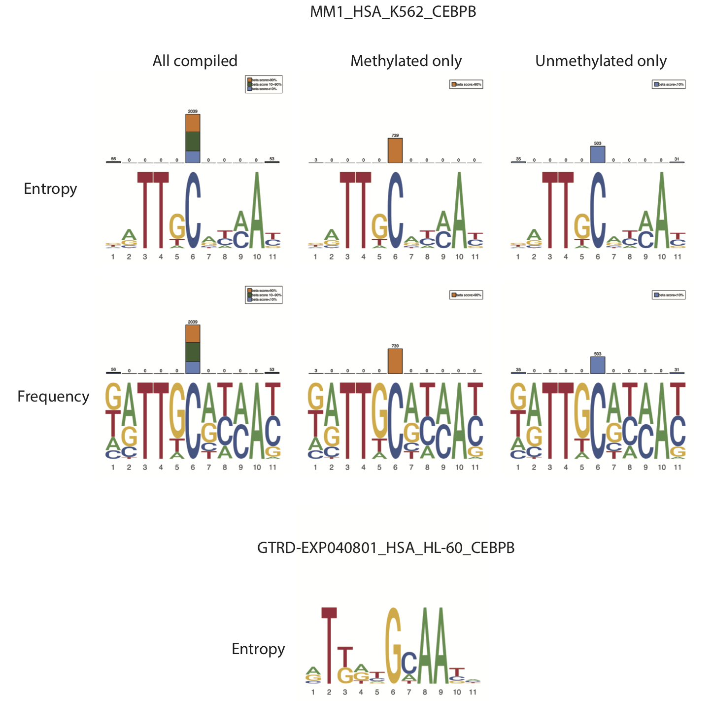
```

Motif matrix as well as beta score matrix, if available, can be saved locally using `exportMMPFM`. 
To be noted, the function `exportMMPFM` is also able to export (Meth)Motif matrix for 
the outputs of `commonPeaks`, `exclusivePeaks` and `intersectPeakMatrix` by specifying "fun = ".
We will introduce it in the following section.

```{r eval=FALSE}
# export MethMotif matrix for MM1_HSA_K562_CEBPB
exportMMPFM(fun_output = K562_CEBPB, fun = "searchMethMotif", save_motif_PFM = T, save_betaScore_matrix = T)
#> Start exporting ... ...
#> ... ... You chose to save motif PFM and beta score matrix.
#> ... ... export searchMotif
#> ... ... ... ... Beta score matrix has been saved as 'MM1_HSA_K562_CEBPB-methScore.txt'.
#> ... ... ... ... Motif PFM has been saved as 'MM1_HSA_K562_CEBPB-motif-MEME.txt'.

# export motif matrix for GTRD-EXP040801_HSA_HL-60_CEBPB
exportMMPFM(fun_output = HL60_CEBPB, fun = "searchMotif", save_motif_PFM = T, save_betaScore_matrix = T)
#> Start exporting ... ...
#> ... ... You chose to save motif PFM and beta score matrix.
#> ... ... export searchMotif
#> ... ... ... ... No beta score matrix is available. Skip!
#> ... ... ... ... Motif PFM has been saved as 'GTRD-EXP040801_HSA_HL-60_CEBPB-motif-MEME.txt'.

# exprot motif matrix in TRANSFAC format
K562_CEBPB_TRANSFAC <- searchMotif(id = "MM1_HSA_K562_CEBPB", motif_format = "TRANSFAC")
#> There are a matched record exported in a MethMotif object.
exportMMPFM(fun_output <- K562_CEBPB_TRANSFAC, fun = "searchMotif", save_motif_PFM = T, save_betaScore_matrix = T)
#> Start exporting ... ...
#> ... ... You chose to save motif PFM and beta score matrix.
#> ... ... export searchMotif
#> ... ... ... ... Beta score matrix has been saved as 'MM1_HSA_K562_CEBPB-methScore.txt'.
#> ... ... ... ... Motif PFM has been saved as 'MM1_HSA_K562_CEBPB-motif-TRANSFAC.txt'.
```

More importantly, we allow the users to load peak regions (all peaks or peaks only with motif) 
of all TFs in TFregulome database using `loadPeaks`. To be noted, the peak regions of a given 
TF in TFregulome database are the peak summits (hg38 for human), and the TFBS is enriched 
in a +/- 100bp window surrounding the peak summits.

```{r eval=FALSE}
K562_CEBPB_peaks <- loadPeaks(id = "MM1_HSA_K562_CEBPB", includeMotifOnly = T)
#> Success: peak file has been returned in a data frame!
head(K562_CEBPB_peaks)
#>    chr     start       end                                    id
#> 1 chr3 101823721 101823722 MM1_HSA_K562_CEBPB_peaks_with_motif_1
#> 2 chr3 101850619 101850620 MM1_HSA_K562_CEBPB_peaks_with_motif_2
#> 3 chr3 102182290 102182291 MM1_HSA_K562_CEBPB_peaks_with_motif_3
#> 4 chr3 105626970 105626971 MM1_HSA_K562_CEBPB_peaks_with_motif_4
#> 5 chr3 105647238 105647239 MM1_HSA_K562_CEBPB_peaks_with_motif_5
#> 6 chr3 105899733 105899734 MM1_HSA_K562_CEBPB_peaks_with_motif_6
```

## Study TFBS propensity

### Common peak regions

TFregulomeR provides the functionality to find the common peak regions along with DNA methylation 
profiling using `commonPeaks`. 
For the target peak sets, users can directly use TFregulome TF peaks (hg38 for human) by using its TFregulome IDs in `target_peak_id` 
(all peaks or peaks with motif only can be selected using `motif_only_for_target_peak`), or their
own peaks regions in `user_target_peak_list`. If customised peak sets are provided, all peak sets 
should be stored in an R list(), and each peak set should be a bed-format data.frame with the 
first three columns as chromosome (starting with 'chr'), start and end. It's recommended that users 
provide the unique IDs for their customised peak list (also should be unique to provided TFregulome 
ID list in `target_peak_id`). If unavailable, the function will automatically assign IDs for the 
provided peak sets. It should be noted that if the customised peak set is a subset of a TFregulome 
peak set, it's highly recommended that its TFregulome ID should be provided correspondingly in 
`user_target_peak_id` if one opts to profile the DNA methylation levels for the peaks. Even though TFregulome peak sets 
are peak summits, the function is able to recognise it with the provided TFregulome ID in `user_target_peak_id` and
automatically expand +/- 100bp during the analysis. Similar rules are applicable to options `compared_peak_id`,
`motif_only_for_compared_peak`, `user_compared_peak_list` and `user_compared_peak_id` when loading compared peak sets.

During the analyisis, each target peak set from `target_peak_id` (will be automatically loaded from TFregulome database during analysis) and 
`user_target_peak_list` will be compared with all input compared peak sets from `compared_peak_id` and 
`user_compared_peak_list`, to get the final common peak subsets for each target set. 
If `methylation_profile_in_narrow_region=T`, DNA methylation profiling in 100bp surrounding peak summit will be performed 
for each common peak subset whose source is MethMotif in `target_peak_id` and `user_compared_peak_list` with TFregulome IDs 
indicated in `user_target_peak_id`.

```{r eval=FALSE}
# read my local file. Here we use the HCT116 CEBPB binding sites published in Nucleic Acids Research
my_peak_path <- system.file("extdata", "HCT116_CEBPb_binding_sites.txt", package = "TFregulomeR")
my_peak <- read.delim(my_peak_path, sep = "\t", header = F)
head(my_peak)
#>      V1        V2        V3
#> 1  chr1  58585814  58585827
#> 2 chr12 122925699 122925712
#> 3  chr9   5818111   5818124
#> 4 chr19   5850889   5850902
#> 5 chr10   5951274   5951287
#> 6  chr1   8175025   8175038

# To get the common subsets of K562 CEBPB peaks and my peaks, which are 
# common with (conserved in) the CEBPB peaks in all cell types available in TFregulome database,
# and at the same time to profile the DNA methylation states in the common subsets

# 1) Get all CEBPB records in TFregulome database
CEBPB_record <- TFBSBrowser(tf = "CEBPB")
#> 16 TFBS(s) founded: ...
#> ... covering 1 TF(s)
#> ... from 1 species:
#> ... ...human
#> ... from 9 organ(s):
#> ... ... colorectum, uterus, blood_and_lymph, stem_cell, bone, lung, cervix, liver, breast
#> ... in 2 sample type(s):
#> ... ... cell_line, primary_cells
#> ... in  16  different cell(s) or tissue(s)
#> ... in 2 type(s) of disease state(s):
#> ... ... tumor, normal
#> ... from the source(s): GTRD, MethMotif

# 2) Start commonPeaks analysis
commonPeak_output <- commonPeaks(target_peak_id = "MM1_HSA_K562_CEBPB",
                                 motif_only_for_target_peak = T, 
                                 user_target_peak_list = list(my_peak), 
                                 user_target_peak_id = c("HCT116_CEBPB"), 
                                 compared_peak_id = CEBPB_record$ID, 
                                 motif_only_for_compared_peak = T, 
                                 methylation_profile_in_narrow_region = T)
#> TFregulomeR::commonPeaks() starting ... ...
#> You chose to profile the methylation levels in 200bp window around peak summits, 
#> if there is any peak loaded from TFregulome
#> Loading target peak list ... ...
#> ... You have 1 TFBS(s) requested to be loaded from TFregulome server
#> ... You chose to load TF peaks with motif only. Using 'motif_only_for_target_peak' tunes your options
#> ... loading TFBS(s) from TFregulome now
#> .. ... peak file loaded successfully for id 'MM1_HSA_K562_CEBPB'
#> ... Done loading TFBS(s) from TFregulome
#> ... You have 1 customised peak set(s)
#> Loading compared peak list ... ...
#> ... You have 16 TFBS(s) requested to be loaded from TFregulome server
#> ... You chose to load TF peaks with motif only. Using 'motif_only_for_compared_peak' tunes your options
#> ... loading TFBS(s) from TFregulome now
#> .. ... peak file loaded successfully for id 'GTRD-EXP000142_HSA_LS180_CEBPB'
#> .. ... peak file loaded successfully for id 'GTRD-EXP010975_HSA_Ishikawa_CEBPB'
#> .. ... peak file loaded successfully for id 'GTRD-EXP030173_HSA_LoVo_CEBPB'
#> .. ... peak file loaded successfully for id 'GTRD-EXP030702_HSA_blood-monocytes_CEBPB'
#> .. ... peak file loaded successfully for id 'GTRD-EXP034967_HSA_mesenchymal-stem-cells_CEBPB'
#> .. ... peak file loaded successfully for id 'GTRD-EXP036478_HSA_fetal-osteoblasts_CEBPB'
#> .. ... peak file loaded successfully for id 'GTRD-EXP040652_HSA_monocyte-derived-macrophages_CEBPB'
#> .. ... peak file loaded successfully for id 'GTRD-EXP040801_HSA_HL-60_CEBPB'
#> .. ... peak file loaded successfully for id 'MM1_HSA_A549_CEBPB'
#> .. ... peak file loaded successfully for id 'MM1_HSA_H1-hESC_CEBPB'
#> .. ... peak file loaded successfully for id 'MM1_HSA_HCT116_CEBPB'
#> .. ... peak file loaded successfully for id 'MM1_HSA_HeLa-S3_CEBPB'
#> .. ... peak file loaded successfully for id 'MM1_HSA_HepG2_CEBPB'
#> .. ... peak file loaded successfully for id 'MM1_HSA_IMR-90_CEBPB'
#> .. ... peak file loaded successfully for id 'MM1_HSA_K562_CEBPB'
#> .. ... peak file loaded successfully for id 'MM1_HSA_MCF-7_CEBPB'
#> ... Done loading TFBS(s) from TFregulome
#> Start analysing: MM1_HSA_K562_CEBPB... ...
#> Start analysing: HCT116_CEBPB... ...
#> Done analysing.
```

After obtaining the output of `commonPeaks`, you can use `commonPeakResult` to get 
1) the summary, 2) the common peak regions, 3) DNA methylation levels in common peak subsets if the input source is 
MethMotif in TFregulome database and 4) the (Meth)Motif logo if input is from TFregulome or with TFregulome ID.

```{r eval=FALSE}
commonPeak_result <- commonPeakResult(commonPeaks = commonPeak_output,
                                      return_common_peak_sites = T, 
                                      save_MethMotif_logo = T, 
                                      return_methylation_profile = T, 
                                      return_summary = T)
#> Start getting the results of commonPeakResult ...
#> ... ... You chose to return common peak sites;
#> ... ... You chose to return methylation profile;
#> ... ... You chose to return common peak summary;
#> ... ... ... ALL of common peak sets, methylation profiles and peak summary will be 
#> stored in a list, and named with 'common_peak_list', 'methylation_profile' and 
#> 'peak_summary' in the list. Use 'names()' in the output for its detials.
#> ... ... You chose to save MethMotif logo in PDF if any;
#> ... ... ... You chose entropy logo;
#> ... ... ... You chose to show all methylation levels;
#> Success: a PDF named 'MM1_HSA_K562_CEBPB_common_peaks-logo-entropy.pdf' has been saved!
#> ... ... ... The input peak set for the results 'HCT116_CEBPB_common_peaks' was 
#> not orginated from TFregulome or the number of direct binding sites in the 
#> common peaks is 0, so no motif logo available.

# the contents in commonPeak_result
names(commonPeak_result)
#> [1] "common_peak_list"    "methylation_profile" "peak_summary" 
common_peak_list <- commonPeak_result$common_peak_list
methylation_profile <- commonPeak_result$methylation_profile
peak_summary <- commonPeak_result$peak_summary

# peak summary: 1.137225% of K562 CEBPB peaks and 2.517540% of my peaks are common with 
# the CEBPB peaks in all cell types available in TFregulome database.
peak_summary
#>                                 percentage_in_original_inputs(%)
#> MM1_HSA_K562_CEBPB_common_peaks                         1.137225
#> HCT116_CEBPB_common_peaks                               2.517540

# common peak regions
K562_CEBPB_common_peak <- common_peak_list$MM1_HSA_K562_CEBPB_common_peaks
head(K562_CEBPB_common_peak)
#>      chr     start       end                                      id
#> 39  chr3 126261153 126261154  MM1_HSA_K562_CEBPB_peaks_with_motif_39
#> 145 chr3 152100699 152100700 MM1_HSA_K562_CEBPB_peaks_with_motif_145
#> 276 chr3 188239782 188239783 MM1_HSA_K562_CEBPB_peaks_with_motif_276
#> 283 chr3 194003766 194003767 MM1_HSA_K562_CEBPB_peaks_with_motif_283
#> 435 chr4  73704747  73704748 MM1_HSA_K562_CEBPB_peaks_with_motif_435
#> 456 chr4  77158137  77158138 MM1_HSA_K562_CEBPB_peaks_with_motif_456

# methylation profile in common peak regions
names(methylation_profile)
#> [1] "MM1_HSA_K562_CEBPB_common_peaks" "HCT116_CEBPB_common_peaks"
methylation_profile$MM1_HSA_K562_CEBPB_common_peaks
#>         CpG_num
#> 0-10%       161  #161 CpG methylation scores are less than 0.1 in +/-100bp window around common peak summits
#> 10-20%        9
#> 20-30%       17
#> 30-40%        2
#> 40-50%        1
#> 50-60%        2
#> 60-70%        9
#> 70-80%        5
#> 80-90%       13
#> 90-100%      25 #25 CpG methylation scores are more than 0.9 in +/-100bp window around common peak summits
# customised input peaks are not orginated from TFregulome database, so no DNA methylation states
methylation_profile$HCT116_CEBPB_common_peaks
#>      [,1]
#> [1,]   NA
```

```{r echo=FALSE, fig.cap="Figure 2. MethMotif logo of K562 CEBPB common peaks", out.width = '40%', fig.align="center"}
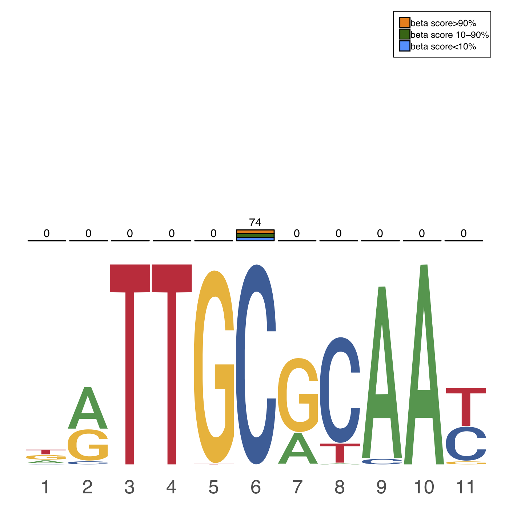
```

### Exclusive peak regions

Exclusive peak regions are important to study a TF's context-specifc function. 
Hence, we implemented such functionality to achieve the extraction of the context dependent peak loci 
along with DNA methylation profiles, `exclusivePeaks`. 

For the target peak sets, users can directly use TFregulome TF peaks (hg38 for human) by using its TFregulome IDs in `target_peak_id` 
(all peaks or peaks with motif only can be selected using `motif_only_for_target_peak`), or their
own peaks regions in `user_target_peak_list`. If customised peak sets are provided, all peak sets 
should be stored in an R list(), and each peak set should be a bed-format data.frame with the 
first three columns as chromosome (starting with 'chr'), start and end. It's recommended that users 
provide the unique IDs for their customised peak list (also should be unique to provided TFregulome 
ID list in `target_peak_id`). If unavailable, the function will automatically assign IDs for the 
provided peak sets. It should be noted that if the customised peak set is a subset of a TFregulome 
peak set, it's highly recommended that its TFregulome ID should be provided correspondingly in 
`user_target_peak_id` if one opts to profile the DNA methylation levels for the peaks. Even though TFregulome peak sets 
are peak summits, the function is able to recognise it with the provided TFregulome ID in `user_target_peak_id` and
automatically expand +/- 100bp during the analysis. Similar rules are applicable to options `excluded_peak_id`,
`motif_only_for_excluded_peak`, `user_excluded_peak_list` and `user_excluded_peak_id` when loading compared peak sets.

During the analyisis, each target peak set from `target_peak_id` (will be automatically loaded from TFregulome database during analysis) and 
`user_target_peak_list` will be compared with all input excluded peak sets from `excluded_peak_id` and 
`user_excluded_peak_list`, to get the final unique peak subsets for each target set. 
If `methylation_profile_in_narrow_region=T`, DNA methylation profiling in 100bp surrounding peak summit will be performed 
for each unique peak subset whose source is MethMotif in `target_peak_id` and `user_compared_peak_list` with TFregulome IDs 
indicated in `user_target_peak_id`.

```{r eval=FALSE}
# To get the exclusive subset of K562 CEBPB peaks and my peaks,
# and at the same time to profile the DNA methylation states in the exclusive subsets

# 1) Get all CEBPB records in TFregulome database
CEBPB_record <- TFBSBrowser(tf = "CEBPB")
#> 16 TFBS(s) founded: ...
#> ... covering 1 TF(s)
#> ... from 1 species:
#> ... ...human
#> ... from 9 organ(s):
#> ... ... colorectum, uterus, blood_and_lymph, stem_cell, bone, lung, cervix, liver, breast
#> ... in 2 sample type(s):
#> ... ... cell_line, primary_cells
#> ... in  16  different cell(s) or tissue(s)
#> ... in 2 type(s) of disease state(s):
#> ... ... tumor, normal
#> ... from the source(s): GTRD, MethMotif

# 2) All CEBPB TFregulome ID except MM1_HSA_K562_CEBPB
CEBPB_record_ID_noK562 <- CEBPB_record$ID[!(CEBPB_record$ID %in% "MM1_HSA_K562_CEBPB")]
exclusivePeak_output <- exclusivePeaks(target_peak_id = "MM1_HSA_K562_CEBPB", 
                                       motif_only_for_target_peak = T, 
                                       excluded_peak_id = CEBPB_record_ID_noK562, 
                                       motif_only_for_excluded_peak = T, 
                                       methylation_profile_in_narrow_region = T)
#> TFregulomeR::exclusivePeaks() starting ... ...
#> You chose to profile the methylation levels in 200bp window around peak summits, 
#> if there is any peak loaded from TFregulome
#> Loading target peak list ... ...
#> ... You have 1 TFBS(s) requested to be loaded from TFregulome server
#> ... You chose to load TF peaks with motif only. Using 'motif_only_for_target_peak' tunes your options
#> ... loading TFBS(s) from TFregulome now
#> .. ... peak file loaded successfully for id 'MM1_HSA_K562_CEBPB'
#> ... Done loading TFBS(s) from TFregulome
#> Loading excluded peak list ... ...
#> ... You have 15 TFBS(s) requested to be loaded from TFregulome server
#> ... You chose to load TF peaks with motif only. Using 'motif_only_for_excluded_peak' tunes your options
#> ... loading TFBS(s) from TFregulome now
#> .. ... peak file loaded successfully for id 'GTRD-EXP000142_HSA_LS180_CEBPB'
#> .. ... peak file loaded successfully for id 'GTRD-EXP010975_HSA_Ishikawa_CEBPB'
#> .. ... peak file loaded successfully for id 'GTRD-EXP030173_HSA_LoVo_CEBPB'
#> .. ... peak file loaded successfully for id 'GTRD-EXP030702_HSA_blood-monocytes_CEBPB'
#> .. ... peak file loaded successfully for id 'GTRD-EXP034967_HSA_mesenchymal-stem-cells_CEBPB'
#> .. ... peak file loaded successfully for id 'GTRD-EXP036478_HSA_fetal-osteoblasts_CEBPB'
#> .. ... peak file loaded successfully for id 'GTRD-EXP040652_HSA_monocyte-derived-macrophages_CEBPB'
#> .. ... peak file loaded successfully for id 'GTRD-EXP040801_HSA_HL-60_CEBPB'
#> .. ... peak file loaded successfully for id 'MM1_HSA_A549_CEBPB'
#> .. ... peak file loaded successfully for id 'MM1_HSA_H1-hESC_CEBPB'
#> .. ... peak file loaded successfully for id 'MM1_HSA_HCT116_CEBPB'
#> .. ... peak file loaded successfully for id 'MM1_HSA_HeLa-S3_CEBPB'
#> .. ... peak file loaded successfully for id 'MM1_HSA_HepG2_CEBPB'
#> .. ... peak file loaded successfully for id 'MM1_HSA_IMR-90_CEBPB'
#> .. ... peak file loaded successfully for id 'MM1_HSA_MCF-7_CEBPB'
#> ... Done loading TFBS(s) from TFregulome
#> Start analysing: MM1_HSA_K562_CEBPB... ...
#> Done analysing.
```

After obtaining the output of `exclusivePeaks`, you can use `exclusivePeakResult` to get 
1) the summary, 2) the exclusive peak regions, 3) DNA methylation levels in exclusive peak subsets if the input source is 
MethMotif in TFregulome database and 4) the (Meth)Motif logo if input is from TFregulome or with TFregulome ID.

```{r eval=FALSE}
exclusivePeak_result <- exclusivePeakResult(exclusivePeaks = exclusivePeak_output,
                                            return_exclusive_peak_sites = T,
                                            save_MethMotif_logo = T, 
                                            return_methylation_profile = T,
                                            return_summary = T)
#> Start getting the results of exclusivePeaks ...
#> ... ... You chose to return exclusive peak sites;
#> ... ... You chose to return methylation profile;
#> ... ... You chose to return exclusive peak summary;
#> ... ... ... ALL of exclusive peak sets, methylation profiles and peak summary will 
#> be stored in a list, and named with 'exclusive_peak_list', 'methylation_profile' and 
#> 'peak_summary' in the list. Use 'names()' in the output for its detials.
#> ... ... You chose to save MethMotif logo in PDF if any;
#> ... ... ... You chose entropy logo;
#> ... ... ... You chose to show all methylation levels;
#> Success: a PDF named 'MM1_HSA_K562_CEBPB_exclusive_peaks-logo-entropy.pdf' has been saved!

# the contents in exclusivePeak_result
names(exclusivePeak_result)
#> [1] "exclusive_peak_list" "methylation_profile" "peak_summary" 
exclusive_peak_list <- exclusivePeak_result$exclusive_peak_list
peak_summary <- exclusivePeak_result$peak_summary
methylation_profile <- exclusivePeak_result$methylation_profile

# peak summary, 9.110437% of K562 CEBPB peaks are unique compared with 
# all CEBPB TFBSs in TFregulome database
peak_summary
#>                                    percentage_in_original_inputs(%)
#> MM1_HSA_K562_CEBPB_exclusive_peaks                         9.110437

K562_CEBPB_exclusive_peak <- exclusive_peak_list$MM1_HSA_K562_CEBPB_exclusive_peaks
head(K562_CEBPB_exclusive_peak)
#>     chr     start       end                                     id
#> 4  chr3 105626970 105626971  MM1_HSA_K562_CEBPB_peaks_with_motif_4
#> 22 chr3 119695686 119695687 MM1_HSA_K562_CEBPB_peaks_with_motif_22
#> 45 chr3 128415444 128415445 MM1_HSA_K562_CEBPB_peaks_with_motif_45
#> 57 chr3 130184388 130184389 MM1_HSA_K562_CEBPB_peaks_with_motif_57
#> 58 chr3 130343212 130343213 MM1_HSA_K562_CEBPB_peaks_with_motif_58
#> 68 chr3 133629332 133629333 MM1_HSA_K562_CEBPB_peaks_with_motif_68

# methylation profile in exclusive peak regions
names(methylation_profile)
#> [1] "MM1_HSA_K562_CEBPB_exclusive_peaks"
methylation_profile$MM1_HSA_K562_CEBPB_exclusive_peaks
#>         CpG_num
#> 0-10%       852  #852 CpG methylation scores are less than 0.1 in +/-100bp window around exclusive peak summits
#> 10-20%      149
#> 20-30%       86
#> 30-40%       63
#> 40-50%       45
#> 50-60%       39
#> 60-70%       25
#> 70-80%       46
#> 80-90%       29
#> 90-100%      40 #40 CpG methylation scores are less than 0.1 in +/-100bp window around exclusive peak summits
```

```{r echo=FALSE, fig.cap="Figure 3. MethMotif logo of K562 CEBPB exclusive peaks", out.width = '40%', fig.align="center"}
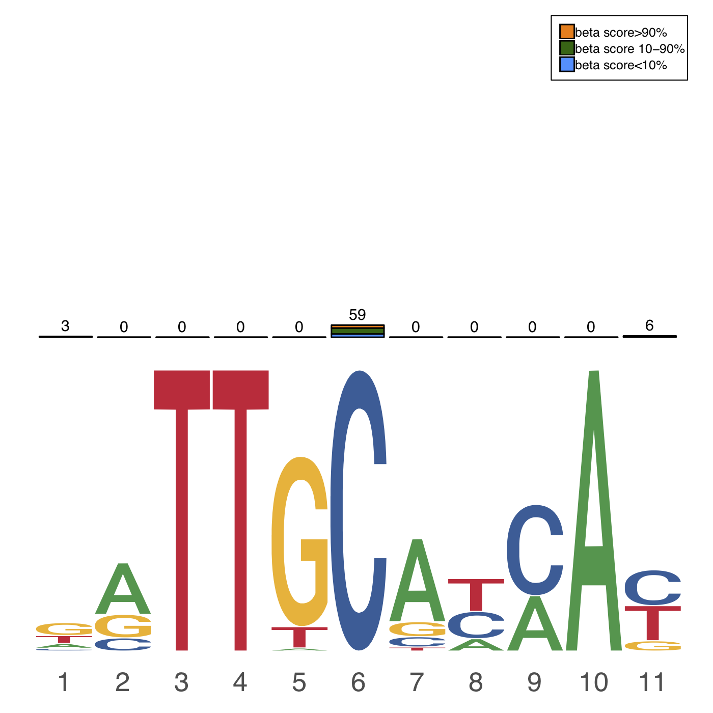
```

### Intersected peak matrix

TFregulomeR allows users to portray the co-binding landscapes between two collections 
of TFs, along with DNA methylation states in the pair-wise intersected peaks, using `intersectPeakMatrix`. 
This functionality is particularly useful to study TF interactome in a cell type. Different from `commonPeaks`, 
`intersectPeakMatrix` perform a exhaustive intersection between a pair of peak sets, one from list x and the other from list y, 
to form an x*y intersection matrix. Therefore, it is required for users to provide the two lists of peak sets. 

For peak list x, users can directly use TFregulome peaks by providing TFregulome ID in `peak_id_x` and indicating 
whether loading peaks with motif only using `motif_only_for_id_x`. In addition, customised peak sets can also be
input in `user_peak_list_x`. It's recommended that unique IDs (also unique to IDs in `peak_id_x`) be provided for
each customised peak set using `user_peak_x_id`. If the customised peak set is a TFregulome TF subset, it's highly
recommended that the corresponding TFregulome ID be provided in `user_peak_x_id`, which allows the function
to recognise the source of peak set and to properly profile the DNA methylation states in the intersected regions, 
if `methylation_profile_in_narrow_region=T`. Even though TFregulome peak sets 
are peak summits, the function is able to recognise it with the provided TFregulome ID in `peak_id_x` and
automatically expand +/- 100bp during the analysis. Same principles are applicable for peak list y.

```{r eval=FALSE}
# profile the co-binding landscapes of all K562 TFs in MethMotif database surrounding
# K562 CEBPB common and exclusive peaks

# browse all TFBS record in K562
K562_TFBS = TFBSBrowser(cell_tissue_name = "K562")
#> 108 TFBS(s) founded: ...
#> ... covering 108 TF(s)
#> ... from 1 species:
#> ... ...human
#> ... from 1 organ(s):
#> ... ... blood_and_lymph
#> ... in 1 sample type(s):
#> ... ... cell_line
#> ... in  1  different cell(s) or tissue(s)
#> ... in 1 type(s) of disease state(s):
#> ... ... tumor
#> ... from the source(s): MethMotif

# co-binding landscapes in K562 CEBPB common peaks
intersectMatrix_common <- intersectPeakMatrix(user_peak_list_x = list(K562_CEBPB_common_peak), 
                                              user_peak_x_id =  c("MM1_HSA_K562_CEBPB"), 
                                              peak_id_y = K562_TFBS$ID, 
                                              motif_only_for_id_y = T, 
                                              methylation_profile_in_narrow_region = T)
#> TFregulomeR::intersectPeakMatrix() starting ... ...
#> You chose to profile the methylation levels in 200bp window around peak summits, 
#> if there is any peak loaded from TFregulome. It will make the program slow. 
#> Disable it if you want a speedy analysis and do not care about methylation
#> Loading peak list x ... ...
#> ... You have 1 customised peak set(s)
#> Loading peak list y ... ...
#> ... You have 108 TFBS(s) requested to be loaded from TFregulome server
#> ... You chose to load TF peaks with motif only. Using 'motif_only_for_id_y' tunes your options
#> ... loading TFBS(s) from TFregulome now
#> .. ... peak file loaded successfully for id 'MM1_HSA_K562_AFF1'
#> .. ... peak file loaded successfully for id 'MM1_HSA_K562_ARID2'
#> .. ... peak file loaded successfully for id 'MM1_HSA_K562_ARID3A'
#> .. ... peak file loaded successfully for id 'MM1_HSA_K562_ATF1'
#>     ... ...
#> .. ... peak file loaded successfully for id 'MM1_HSA_K562_ZSCAN29'
#> ... Done loading TFBS(s) from TFregulome
#> Start analysing list x:MM1_HSA_K562_CEBPB... ...
#> ... ... Start analysing list y:MM1_HSA_K562_AFF1
#> ... ... Start analysing list y:MM1_HSA_K562_ARID2
#> ... ... Start analysing list y:MM1_HSA_K562_ARID3A
#> ... ... Start analysing list y:MM1_HSA_K562_ATF1
#>     ... ...
#> ... ... Start analysing list y:MM1_HSA_K562_ZSCAN29

# K562 CEBPB exclusive peaks
intersectMatrix_exclusive <- intersectPeakMatrix(user_peak_list_x = list(K562_CEBPB_exclusive_peak), 
                                                 user_peak_x_id = c("MM1_HSA_K562_CEBPB"), 
                                                 peak_id_y = K562_TFBS$ID,
                                                 motif_only_for_id_y = T,
                                                 methylation_profile_in_narrow_region = T)
#> TFregulomeR::intersectPeakMatrix() starting ... ...
#> You chose to profile the methylation levels in 200bp window around peak summits, 
#> if there is any peak loaded from TFregulome. It will make the program slow. 
#> Disable it if you want a speedy analysis and do not care about methylation
#> Loading peak list x ... ...
#> ... You have 1 customised peak set(s)
#> Loading peak list y ... ...
#> ... You have 108 TFBS(s) requested to be loaded from TFregulome server
#> ... You chose to load TF peaks with motif only. Using 'motif_only_for_id_y' tunes your options
#> ... loading TFBS(s) from TFregulome now
#> .. ... peak file loaded successfully for id 'MM1_HSA_K562_AFF1'
#> .. ... peak file loaded successfully for id 'MM1_HSA_K562_ARID2'
#> .. ... peak file loaded successfully for id 'MM1_HSA_K562_ARID3A'
#> .. ... peak file loaded successfully for id 'MM1_HSA_K562_ATF1'
#>     ... ...
#> .. ... peak file loaded successfully for id 'MM1_HSA_K562_ZSCAN29'
#> ... Done loading TFBS(s) from TFregulome
#> Start analysing list x:MM1_HSA_K562_CEBPB... ...
#> ... ... Start analysing list y:MM1_HSA_K562_AFF1
#> ... ... Start analysing list y:MM1_HSA_K562_ARID2
#> ... ... Start analysing list y:MM1_HSA_K562_ARID3A
#> ... ... Start analysing list y:MM1_HSA_K562_ATF1
#>     ... ...
#> ... ... Start analysing list y:MM1_HSA_K562_ZSCAN29
```

We have implemented `intersectPeakMatrixResult` in TFregulomeR package, allowing an easy extraction and interpretation of `intersectPeakMatrix` output. It is worth noting that there are two ways of interpretations in intersection between set A and B, that is, 1) the percentage of A overlapped with B, and 2) the percentage of B intersected with A. The option is usually up to which study object should be focused on. Same principle is applicable for the output of `intersectPeakMatrix`. When users opt to return intersection matrix using `return_intersection_matrix = T` in `intersectPeakMatrixResult`, if s/he wants to know the co-binding profiles in `peak_list_x`, then he/she needs to choose `angle_of_matrix = "x"` and `intersectPeakMatrixResult` will report the percentages of each TF peaks in `peak_list_x` overlapped with each peaks in `peak_list_y`. If methylation level profiling in +/-100bp around intersected peak x is needed, `return_methylation_profile` and angle_of_methylation_profile should be `TRUE` and `"x"` respectively. Similarly, when `save_MethMotif_logo` option is wanted and `angle_of_logo = "x"`, the function will plot and save the (Meth)Motif logos for the intersected TFBSs in `peak_list_x` (if any is originally from TFregulome database). Indeed, it's not necessary to plot all (Met)hMotif logos for every pair of intersection at the same time. One can focus only on some subsets of `peak_list_x` and `peak_list_y`, using `saving_MethMotif_logo_x_id` and `saving_MethMotif_logo_y_id` respectively.

```{r eval=FALSE}
# get the intersection matrix for K562 common peaks
IM_K562_common_result <- intersectPeakMatrixResult(intersectPeakMatrix = intersectMatrix_common, 
                                                   return_intersection_matrix = T, 
                                                   angle_of_matrix = "x")
#> Start getting the results of intersectPeakMatrix ...
#> ... ... You chose to return intersection matrix;
#> ... ... ... You chose x-wise intersection matrix;
#> ... ... You chose NOT to return methylation profile;
#> ... ... You chose NOT to save MethMotif logo in PDF if any;

names(IM_K562_common_result)
#> [1] "intersection_matrix"
# the output of IM_K562_common_result, e.g. 1.111111%, 3.333333% and  1.111111% 
# of K562 common peaks overlapped with MM1_HSA_K562_AFF1, MM1_HSA_K562_ARID2 and 
# MM1_HSA_K562_ARID3A respectively.
IM_K562_common_result$intersection_matrix[1,1:3]
#>                    MM1_HSA_K562_AFF1 MM1_HSA_K562_ARID2 MM1_HSA_K562_ARID3A
#> MM1_HSA_K562_CEBPB          1.111111           3.333333            1.111111

# find the top 10 TFs co-binding in K562 common results
IM_K562_common_result_t <- as.data.frame(t(IM_K562_common_result$intersection_matrix))
attach(IM_K562_common_result_t)
IM_K562_common_result_order <- as.data.frame(IM_K562_common_result_t[order(-MM1_HSA_K562_CEBPB),,drop = FALSE])
detach(IM_K562_common_result_t)
head(IM_K562_common_result_order, n = 10)
#>                    MM1_HSA_K562_CEBPB
#> MM1_HSA_K562_CEBPB         100.000000
#> MM1_HSA_K562_CEBPD          36.666667
#> MM1_HSA_K562_CTCF           12.222222
#> MM1_HSA_K562_E4F1           10.000000
#> MM1_HSA_K562_JUND           10.000000
#> MM1_HSA_K562_JUN             8.888889
#> MM1_HSA_K562_CTCFL           7.777778
#> MM1_HSA_K562_ELF4            7.777778
#> MM1_HSA_K562_ATF4            6.666667
#> MM1_HSA_K562_FOSL1           6.666667

# The highest co-binding factor in K562 CEBPB common peaks is CEBPD.
# Then plot MethMotif logo for the K562 CEBPB common sites intersected with CEBPD peaks
intersectPeakMatrixResult(intersectPeakMatrix = intersectMatrix_common, 
                          save_MethMotif_logo = T, 
                          angle_of_logo = "x", 
                          saving_MethMotif_logo_y_id = c("MM1_HSA_K562_CEBPD"))
#> Start getting the results of intersectPeakMatrix ...
#> ... ... You chose NOT to return intersection matrix;
#> ... ... You chose NOT to return methylation profile;
#> ... ... You chose to save MethMotif logo in PDF if any;
#> ... ... ... You chose x-wise MethMotif logo;
#> ... ... ... You chose entropy logo;
#> ... ... ... You chose to show all methylation levels;
#> Success: a PDF named 'MM1_HSA_K562_CEBPB_overlapped_with_MM1_HSA_K562_CEBPD-logo-entropy.pdf' 
#> has been saved!

# get the intersection matrix for K562 exclusive peaks
IM_K562_exclusive_result <- intersectPeakMatrixResult(intersectPeakMatrix = intersectMatrix_exclusive, 
                                                      return_intersection_matrix = T, 
                                                      angle_of_matrix = "x")
#> Start getting the results of intersectPeakMatrix ...
#> ... ... You chose to return intersection matrix;
#> ... ... ... You chose x-wise intersection matrix;
#> ... ... You chose NOT to return methylation profile;
#> ... ... You chose NOT to save MethMotif logo in PDF if any;

names(IM_K562_exclusive_result)
#> [1] "intersection_matrix"
# the output of IM_K562_exclusive_result, e.g. 0.4160888%, 0% and  0.554785% 
# of K562 exclusive peaks overlapped with MM1_HSA_K562_AFF1, MM1_HSA_K562_ARID2 and 
# MM1_HSA_K562_ARID3A respectively.
IM_K562_exclusive_result$intersection_matrix[1,1:3]
#>                    MM1_HSA_K562_AFF1 MM1_HSA_K562_ARID2 MM1_HSA_K562_ARID3A
#> MM1_HSA_K562_CEBPB         0.4160888                  0            0.554785

# find the top 10 TFs co-binding in K562 exclusive results
IM_K562_exclusive_result_t <- as.data.frame(t(IM_K562_exclusive_result$intersection_matrix))
attach(IM_K562_exclusive_result_t)
IM_K562_exclusive_result_order <- as.data.frame(IM_K562_exclusive_result_t[order(-MM1_HSA_K562_CEBPB),,drop = FALSE])
detach(IM_K562_exclusive_result_t)
head(IM_K562_exclusive_result_order, n = 10)
#>                      MM1_HSA_K562_CEBPB
#> MM1_HSA_K562_CEBPB           100.000000
#> MM1_HSA_K562_ATF4             35.367545
#> MM1_HSA_K562_TCF12            17.337032
#> MM1_HSA_K562_CBFA2T3          16.643551
#> MM1_HSA_K562_TAL1             16.366158
#> MM1_HSA_K562_GATA1            11.650485
#> MM1_HSA_K562_FOXM1             9.431345
#> MM1_HSA_K562_ATF7              8.876560
#> MM1_HSA_K562_NFE2              8.599168
#> MM1_HSA_K562_NR2F1             6.518724

# The highest co-binding factor in K562 CEBPB exclusive peaks is ATF4.
# Then plot MethMotif logo for the K562 CEBPB exclusive sites intersected with ATF4 peaks
intersectPeakMatrixResult(intersectPeakMatrix = intersectMatrix_exclusive, 
                          save_MethMotif_logo = T, 
                          angle_of_logo = "x", 
                          saving_MethMotif_logo_y_id = c("MM1_HSA_K562_ATF4"))
#> Start getting the results of intersectPeakMatrix ...
#> ... ... You chose NOT to return intersection matrix;
#> ... ... You chose NOT to return methylation profile;
#> ... ... You chose to save MethMotif logo in PDF if any;
#> ... ... ... You chose x-wise MethMotif logo;
#> ... ... ... You chose entropy logo;
#> ... ... ... You chose to show all methylation levels;
#> Success: a PDF named 'MM1_HSA_K562_CEBPB_overlapped_with_MM1_HSA_K562_ATF4-logo-entropy.pdf' 
#> has been saved!
```

```{r echo=FALSE, fig.cap="Figure 4. MethMotif logo of K562 CEBPB common peaks intersected with K562 CEBPD peaks", out.width = '40%', fig.align="center"}
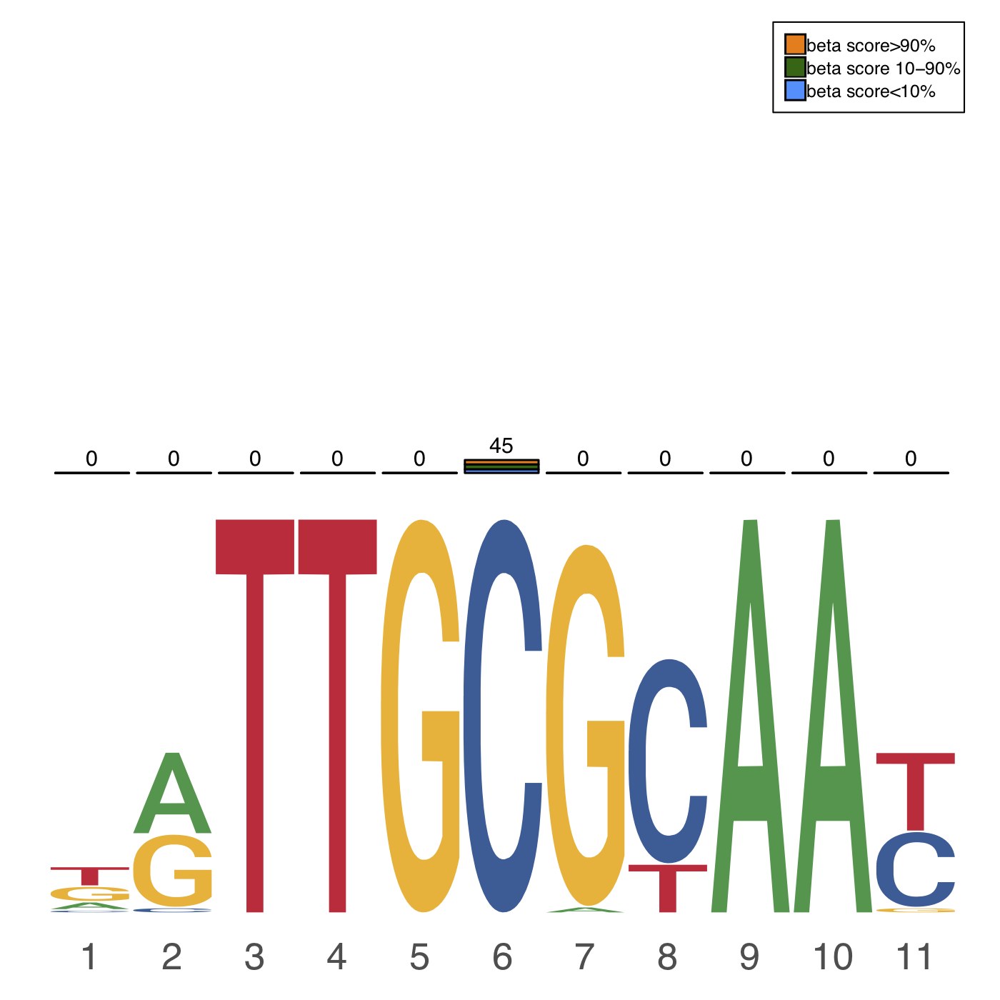
```

```{r echo=FALSE, fig.cap="Figure 5. MethMotif logo of K562 CEBPB exclusive peaks intersected with K562 ATF4 peaks", out.width = '40%', fig.align="center"}
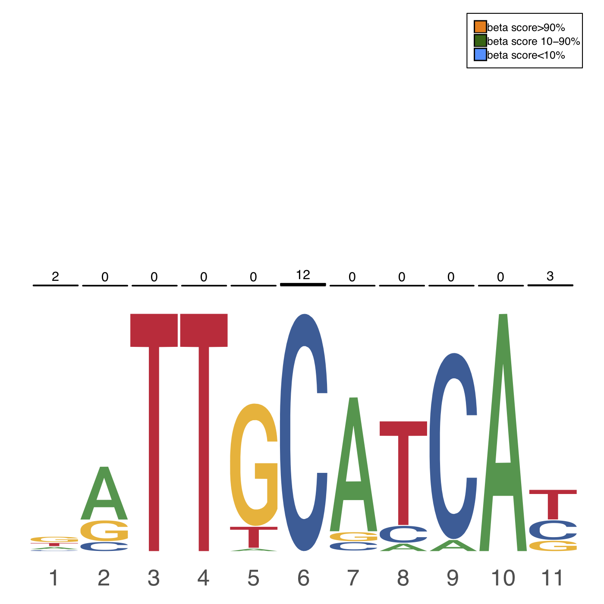
```

### Export motif PFM and beta score matrix

As aforementioned, `exportMMPFM` is not only designed for `searchMotif` outputs, but also compatible with the outputs from `commonPeaks`, `exclusivePeaks`, `intersectPeakMatrix`. Here, we want to export the motif PFMs and beta score matrices for K562 CEBPB common and exclusive peaks, as well as the common peaks intersected with CEBPD peaks and the exclusive peaks intersected with ATF4 peaks.

```{r eval=FALSE}
# export motif PFM and beta score matrix for K562 CEBPB common peaks
exportMMPFM(fun_output = commonPeak_output, 
            fun = "commonPeaks", 
            save_motif_PFM = T, 
            save_betaScore_matrix = T)
#> Start exporting ... ...
#> ... ... You chose to save motif PFM and beta score matrix.
#> ... ... export commonPeaks...
#> ... ... ... export id = MM1_HSA_K562_CEBPB_common_peaks
#> ... ... ... ... Beta score matrix has been saved as 'MM1_HSA_K562_CEBPB_common_peaks-methScore.txt'.
#> ... ... ... ... Motif PFM has been saved as 'MM1_HSA_K562_CEBPB_common_peaks-motif-MEME.txt'.
#> ... ... ... export id = HCT116_CEBPB_common_peaks
#> ... ... ... the original peaks of HCT116_CEBPB_common_peaks is not loaded from TFregulome database, 
#> or in the common peak the number of TFBS is zero. Hence no further action for this id!

# export motif PFM and beta score matrix for K562 CEBPB exclusive peaks
exportMMPFM(fun_output = exclusivePeak_output, 
            fun = "exclusivePeaks", 
            save_motif_PFM = T, 
            save_betaScore_matrix = T)
#> Start exporting ... ...
#> ... ... You chose to save motif PFM and beta score matrix.
#> ... ... export exclusivePeaks...
#> ... ... ... export id = MM1_HSA_K562_CEBPB_exclusive_peaks
#> ... ... ... ... Beta score matrix has been saved as 'MM1_HSA_K562_CEBPB_exclusive_peaks-methScore.txt'.
#> ... ... ... ... Motif PFM has been saved as 'MM1_HSA_K562_CEBPB_exclusive_peaks-motif-MEME.txt'.

# export motif PFM and beta score matrix for K562 CEBPB common peaks intersected with K562 CEBPD peaks
exportMMPFM(fun_output = intersectMatrix_common, 
            fun = "intersectPeakMatrix", 
            save_motif_PFM = T, 
            save_betaScore_matrix = T, 
            angle_of_matrix_for_intersectPeakMatrix = "x", 
            saving_id_y_for_intersectPeakMatrix = c("MM1_HSA_K562_CEBPD"))
#> Start exporting ... ...
#> ... ... You chose to save motif PFM and beta score matrix.
#> ... ... export intersectPeakMatrix...
#> ... ... we will export in the x wide of intersectPeakMatrix output since the input angle_of_matrix_for_intersectPeakMatrix = 'x'
#> ... ... ... export id = MM1_HSA_K562_CEBPB
#> ... ... ... ... Beta score matrix has been saved as 'MM1_HSA_K562_CEBPB_overlapped_with_MM1_HSA_K562_CEBPD-methScore.txt'.
#> ... ... ... ... Motif PFM has been saved as 'MM1_HSA_K562_CEBPB_overlapped_with_MM1_HSA_K562_CEBPD-motif-MEME.txt'.

# export motif PFM and beta score matrix for K562 CEBPB exclusive peaks intersected with K562 ATF4 peaks
exportMMPFM(fun_output = intersectMatrix_exclusive, 
            fun = "intersectPeakMatrix", 
            save_motif_PFM = T, 
            save_betaScore_matrix = T, 
            angle_of_matrix_for_intersectPeakMatrix = "x", 
            saving_id_y_for_intersectPeakMatrix = c("MM1_HSA_K562_ATF4"))
#> Start exporting ... ...
#> ... ... You chose to save motif PFM and beta score matrix.
#> ... ... export intersectPeakMatrix...
#> ... ... we will export in the x wide of intersectPeakMatrix output since the input angle_of_matrix_for_intersectPeakMatrix = 'x'
#> ... ... ... export id = MM1_HSA_K562_CEBPB
#> ... ... ... ... Beta score matrix has been saved as 'MM1_HSA_K562_CEBPB_overlapped_with_MM1_HSA_K562_ATF4-methScore.txt'.
#> ... ... ... ... Motif PFM has been saved as 'MM1_HSA_K562_CEBPB_overlapped_with_MM1_HSA_K562_ATF4-motif-MEME.txt'.
```

### Motif distribution

TFregulomeR also allows uers to plot the distributions of a given TFBS from the TFregulome database in a list of peak sets, using `motifDistrib` and `plotDistrib` sequentially. By providing the TFregulome ID in `id` as the input of the `motifDistrib`, `motifDistrib` will calculate the occurrences the TFBSs in the given list of peak sets input in `peak_list`. The unique IDs correpsonding to `peak_list` is required to be provided at the same time using `peak_id`. If a peak set is a TFregulome TF subset, the TFregulome ID should be input accordingly; if it is self provided, you can name it with a unique ID yourself. 

It should be noted that even though the loaded peak regions from the TFregulome database are the peak summits, you don't need to expand the regions. Once you tell `motifDistrib` the peak set is a TFregulome TF subset by providing MethMotif ID in the `peak_id`, it will automatically operate on the peaks itself.

The output of `motifDistrib` is the input of `plotDistrib`. In each motif distribution plot, x-axis is the relative distance (bp) to the peak center, while y-axis is the percentage of the TFBS at the position.

Here, we show the distributions of K562 CEBPB motif in K562 CEBPB exclusive peaks and our own peaks locally loaded previously.

```{r eval=FALSE}
# loading my peaks
my_peak_path <- system.file("extdata", "HCT116_CEBPb_binding_sites.txt", package = "TFregulomeR")
my_peak <- read.delim(my_peak_path, sep = "\t", header = F)

motifDistrib_output <- motifDistrib(id = "MM1_HSA_K562_CEBPB", 
                                    peak_list = list(K562_CEBPB_exclusive_peak,
                                                     my_peak),
                                    peak_id = c("MM1_HSA_K562_CEBPB","my_peak"))
#> motifDistrib starts analysing for MethMotif ID = MM1_HSA_K562_CEBPB
#> ... ... analysing peak set MM1_HSA_K562_CEBPB
#> ... ... analysing peak set my_peak
plotDistrib(motifDistrib = motifDistrib_output)
#> Distribution of motif MM1_HSA_K562_CEBPB in peak set MM1_HSA_K562_CEBPB has been saved!
#> Distribution of motif MM1_HSA_K562_CEBPB in peak set my_peak has been saved!
```

```{r echo=FALSE, fig.cap="Figure 6. Motif distribution", out.width = '100%', fig.align="center"}
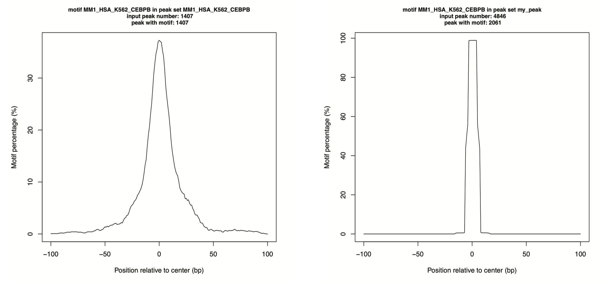
```

## Annotate TFBS locations

TFregulomeR is able to annotate TFBS genomic location by using `genomeAnnotate`. The annotation process is following the order: promoter, TTS, exon, 5' UTR exon, 3' UTR exon, intron and intergenic region. Specifically, promoter is defined as the range from 1000bp upstream of TSS to 100bp downstream of TSS, and TTS is defined as the range from 100bp upstream of TTS to 1000bp downstream of TTS. Users can change the parameters using `promoter_range` and `TTS_range` respectively. The annotation output of `genomeAnnotate` is intuitive, not only will a data.frame containing annotation results be returned, but also an HTML report will be saved.

```{r eval=FALSE}
# annotate the locations of K562 CEBPB exclusive peaks
# loading UCSC knownGene
library(TxDb.Hsapiens.UCSC.hg38.knownGene)

K562_CEBPB_exclusivePeak_loc <- genomeAnnotate(peaks = K562_CEBPB_exclusive_peak, 
                                               return_annotation = T, 
                                               return_html_report = T)
#> Start genomeAnnotate ...
#> ... ... You chose to return annotated results in a data.frame.
#> ... ... You chose to return an HTML report.
#> ... ... annotating promoters defined as upstream 1000bp and downstream 100bp
#> ... ... annotating TTS defined as upstream 100bp and downstream 1000bp
#> ... ... annotating exons
#> ... ... annotating 5' UTR
#> ... ... annotating 3' UTR
#> ... ... annotating introns
#> ... ... annotating intergenic regions
#> ... ... An html report has been generated as 'genomeAnnotate_result.html'!
#> ... ... The annotation results have been returned in a data.frame!

head(K562_CEBPB_exclusivePeak_loc)
#>    chr     start       end                      id   annotation geneName
#> 1 chr3 133629333 133629333  genomeAnnotate_peak_68 promoter-TSS   TOPBP1
#> 2 chr1 155858041 155858041 genomeAnnotate_peak_255 promoter-TSS    GON4L
#> 3 chr3 193662882 193662882 genomeAnnotate_peak_280 promoter-TSS     OPA1
#> 4 chr4  72038972  72038972 genomeAnnotate_peak_426 promoter-TSS   NPFFR2
#> 5 chr4  74448009  74448009 genomeAnnotate_peak_447 promoter-TSS     AREG
#> 6 chr4 143905637 143905637 genomeAnnotate_peak_635 promoter-TSS     GYPE
#>                                                          transcript           distanceToTSS
#> 1                                             uc062nzf.1;uc062nzg.1                 941;602
#> 2 uc001flz.4;uc057lsw.1;uc057lsx.1;uc001fmc.5;uc057lta.1;uc057ltb.1 745;745;745;836;823;745
#> 3                                                        uc062rmv.1                       8
#> 4                                             uc003hgi.3;uc003hgh.3                 205;401
#> 5                                                        uc062xhs.1                     629
#> 6                                  uc003ijj.4;uc062zwx.1;uc003ijk.5               77;117;73
```

```{r echo=FALSE, fig.cap="Figure 7. HTML annotation report of the genomic locations of K562 CEBPB exclusive peak", out.width = '100%', fig.align="center"}
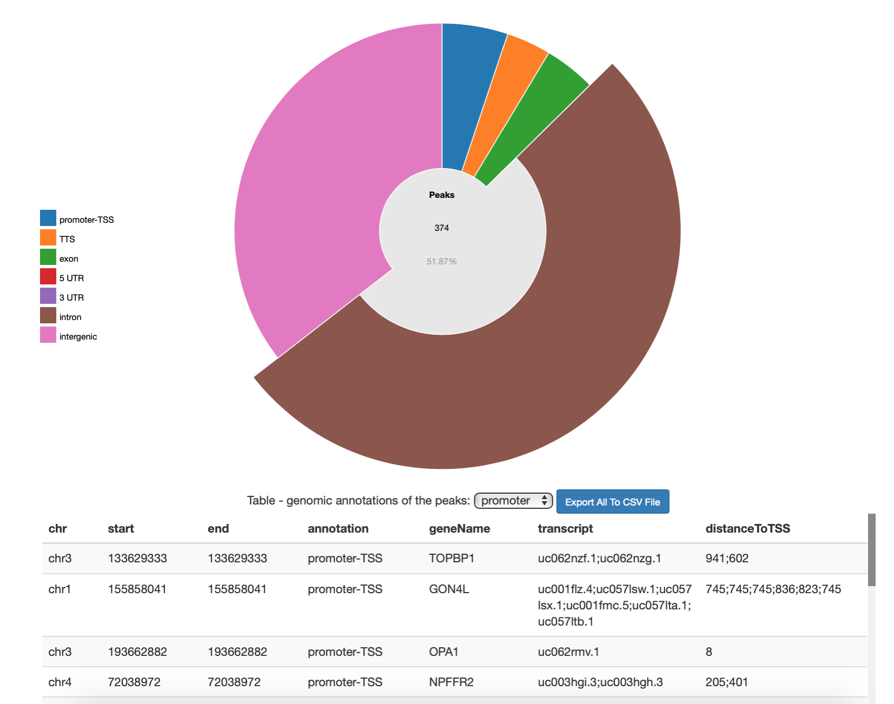
```

## Annotate TFBS functions

The key function of transcription factors is to regulate gene expression. By working with Genomic Regions Enrichment of Annotations Tool (GREAT), TFregulomeR allows users to annotate the TFBSs using `greatAnnotate`. Given that GREAT server doesn't support hg38, liftOver R package has been incorporated in TFregulomeR to convert hg38 to hg19. The annotation output of `greatAnnotate` is intuitive, not only will a data.frame containing annotation results be returned, but also an HTML report will be saved. The HTML report takes advantage of `rbokeh` package, which presents a vivid and dynamic interface (Figure 8).

```{r eval=FALSE}
# annotate the functions of K562 CEBPB exclusive peaks
# loading GREAT R package 'rGREAT'
library(rGREAT)
# the peak assembly is "hg38", and 'liftOver' is needed for conversion
library(liftOver)
# 'rbokeh' is required for an HTML report generation
library(rbokeh)

K562_CEBPB_exclusivePeak_func <- greatAnnotate(peaks = K562_CEBPB_exclusive_peak, 
                                               return_annotation = T, 
                                               return_html_report = T)
#> Start greatAnnotate ...
#> ... ... You chose to return annotated results in a data.frame.
#> ... ... You chose to return an HTML report.
#> ... ... assembly is hg38. Now converting to hg19 using liftOver...
#> ... ... number of the original input regions is 721
#> ... ... number of the regions successfully converted to hg19 is 721
#> ... ... start GREAT analysis
#> ... ... An html report has been generated as 'greatAnnotate_result.html'!
#> ... ... The annotation results have been returned in a data.frame!

head(K562_CEBPB_exclusivePeak_func)
#>   category         ID                             name
#> 1       MF GO:0005488                          binding
#> 2       MF GO:0005515                  protein binding
#> 3       BP GO:0065007            biological regulation
#> 4       BP GO:0050794   regulation of cellular process
#> 5       BP GO:0019222  regulation of metabolic process
#> 6       BP GO:0050789 regulation of biological process
#>   number_of_targeting_genes adjusted_pvalue
#> 1                       817    0.0001415278
#> 2                       497    0.0007221064
#> 3                       653    0.0059313854
#> 4                       602    0.0059313854
#> 5                       386    0.0072758686
#> 6                       628    0.0072758686
```


```{r echo=FALSE, fig.cap="Figure 8. HTML annotation report of the genes targeted by K562 CEBPB exclusive peak", out.width = '100%', fig.align="center"}
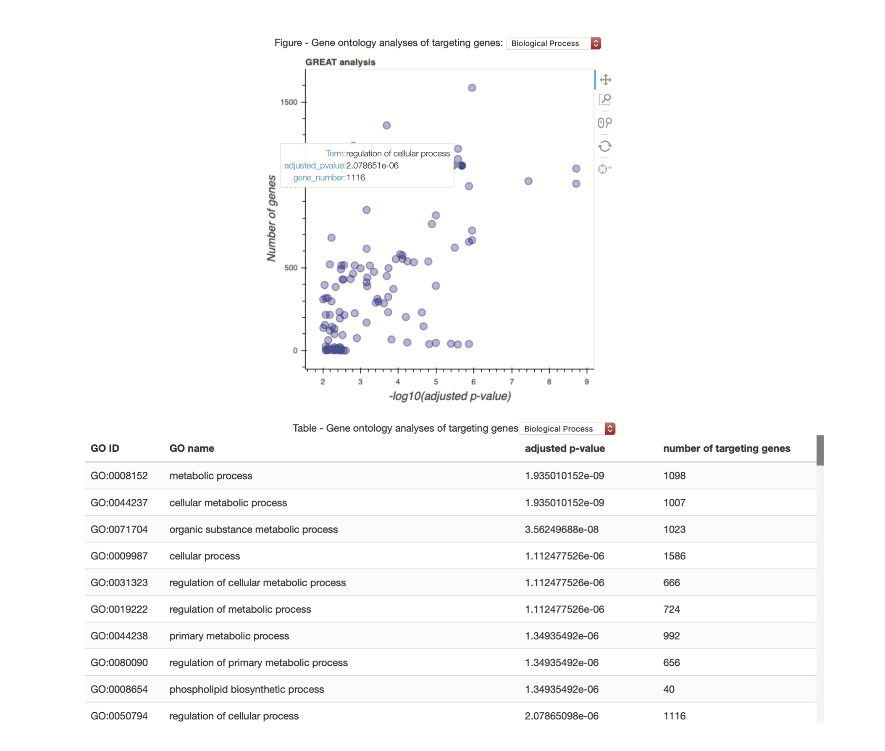
```

## Connect with TFBSTools

TFregulomeR is not working alone. We have built a function allowing conversion of the motif matrix in TFregulome database to the subclass `PFMatrix` in TFBSTools, using `toTFBSTools`.

```{r eval=FALSE}
library(TFBSTools)
K562_CEBPB_TFBS_PFM <- toTFBSTools(id = "MM1_HSA_K562_CEBPB")
K562_CEBPB_TFBS_PFM
#> An object of class PFMatrix
#> ID: MM1_HSA_K562_CEBPB
#> Name: CEBPB
#> Matrix Class: Unknown
#> strand: *
#> Tags: 
#> list()
#> Background: 
#>      A      C      G      T 
#> 0.2717 0.2283 0.2283 0.2717 
#> Matrix: 
#>   [,1] [,2] [,3] [,4] [,5] [,6] [,7] [,8] [,9] [,10] [,11]
#> A   93  305    0    0   49    0  280   91  290   533    15
#> C   61   74    0    0    0  533   59  205  242     0   215
#> G  192  141    0    0  390    0  139    3    0     0    73
#> T  187   13  533  533   94    0   55  234    1     0   230
```

## A case study: MAFF binding partners

Here we are going to use MAFF as an example to provide the evidence that 1) different TF binding partners contribute to the distinct TF motifs across celll types; 2) different methyl-DNA bindnig profiles for the same TF are associated with its dist co-binding partners. TFregulome database records MAFF binding motifs in three cell types (Figure 9), namely K562, HeLa-S3 and HepG2. In K562, MAFF binding sites are prone to hypomethylation, while in the other two cell types, they can be methylated or unmethylated.

```{r eval=FALSE}
# browser MAFF TFBS in TFregulome
MAFF <- TFBSBrowser(tf = "MAFF")
#> 3 TFBS(s) founded: ...
#> ... covering 1 TF(s)
#> ... from 1 species:
#> ... ...human
#> ... from 3 organ(s):
#> ... ... cervix, liver, blood_and_lymph
#> ... in 1 sample type(s):
#> ... ... cell_line
#> ... in  3  different cell(s) or tissue(s)
#> ... in 1 type(s) of disease state(s):
#> ... ... tumor
#> ... from the source(s): MethMotif

# plot and save the (Meth)Motif logos
for (i in MAFF$ID){
  methmotif <- searchMotif(id = i)
  plotLogo(methmotif)
}
#> There are a matched record exported in a MethMotif object.
#> Success: a PDF named 'MM1_HSA_HeLa-S3_MAFF-logo-entropy.pdf' has been saved!
#> There are a matched record exported in a MethMotif object.
#> Success: a PDF named 'MM1_HSA_HepG2_MAFF-logo-entropy.pdf' has been saved!
#> There are a matched record exported in a MethMotif object.
#> Success: a PDF named 'MM1_HSA_K562_MAFF-logo-entropy.pdf' has been saved!
```

```{r echo=FALSE, fig.cap="Figure 9. MethMotif logos of MAFF in three cell types", out.width = '100%', fig.align="center"}
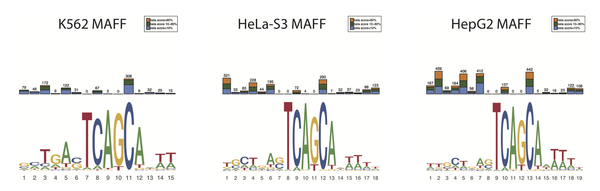
```

Next, we want to extract the MAFF binding sites conserved in the three cell types.

```{r eval=FALSE}
# MAFF common peaks in three cell types

# commonPeaks
MAFF_common_output <- commonPeaks(target_peak_list = list(K562_MAFF_peaks,
                                                          HeLa_MAFF_peaks, 
                                                          HepG2_MAFF_peaks), 
                                  target_peak_id = c("MM1_HSA_K562_MAFF", 
                                                     "MM1_HSA_HeLa-S3_MAFF", 
                                                     "MM1_HSA_HepG2_MAFF"),
                                  compared_peak_list = list(K562_MAFF_peaks,
                                                            HeLa_MAFF_peaks,
                                                            HepG2_MAFF_peaks), 
                                  compared_peak_id = c("MM1_HSA_K562_MAFF",
                                                       "MM1_HSA_HeLa-S3_MAFF",
                                                       "MM1_HSA_HepG2_MAFF"))
#> Start analysing: MM1_HSA_K562_MAFF... ...
#> ... ... Start analysing: MM1_HSA_K562_MAFF
#> ... ... Start analysing: MM1_HSA_HeLa-S3_MAFF
#> ... ... Start analysing: MM1_HSA_HepG2_MAFF
#> Start analysing: MM1_HSA_HeLa-S3_MAFF... ...
#> ... ... Start analysing: MM1_HSA_K562_MAFF
#> ... ... Start analysing: MM1_HSA_HeLa-S3_MAFF
#> ... ... Start analysing: MM1_HSA_HepG2_MAFF
#> Start analysing: MM1_HSA_HepG2_MAFF... ...
#> ... ... Start analysing: MM1_HSA_K562_MAFF
#> ... ... Start analysing: MM1_HSA_HeLa-S3_MAFF
#> ... ... Start analysing: MM1_HSA_HepG2_MAFF

# commonPeaks output extraction
MAFF_common_peaks <- commonPeakResult(commonPeaks = MAFF_common_output, 
                                      return_common_peak_sites = T, 
                                      save_MethMotif_logo = T)
#> Start getting the results of commonPeakResult ...
#> ... ... You chose to return common peak sites;
#> ... ... You chose NOT to return common peak summary;
#> ... ... ... Only list of common peak sets will be returned in a list. Use names() in the output to see the ids of each peak set in the list.
#> ... ... You chose to save MethMotif logo in PDF if any;
#> ... ... ... You chose entropy logo;
#> ... ... ... You chose to show all methylation levels;
#> Success: a PDF named 'MM1_HSA_K562_MAFF_common_peaks-logo-entropy.pdf' has been saved!
#> Success: a PDF named 'MM1_HSA_HeLa-S3_MAFF_common_peaks-logo-entropy.pdf' has been saved!
#> Success: a PDF named 'MM1_HSA_HepG2_MAFF_common_peaks-logo-entropy.pdf' has been saved!

names(MAFF_common_peaks)
#> [1] "MM1_HSA_K562_MAFF_common_peaks"    "MM1_HSA_HeLa-S3_MAFF_common_peaks"
#> [3] "MM1_HSA_HepG2_MAFF_common_peaks"  
K562_MAFF_commonPeaks <- MAFF_common_peaks$MM1_HSA_K562_MAFF_common_peaks
HeLa_MAFF_commonPeaks <- MAFF_common_peaks$`MM1_HSA_HeLa-S3_MAFF_common_peaks`
HepG2_MAFF_commonPeaks <- MAFF_common_peaks$MM1_HSA_HepG2_MAFF_common_peaks
```

```{r echo=FALSE, fig.cap="Figure 9. MethMotif logos of MAFF common peaks in three cell types", out.width = '100%', fig.align="center"}
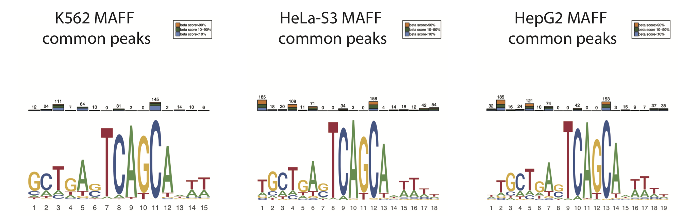
```

Further, we analysed the motif and DNA methylation characteristics in MAFF cell specific binding sites.

```{r eval=FALSE}
# MAFF exclusive peaks in three cell types
# exclusivePeaks
K562_MAFF_exclusive_output <- exclusivePeaks(target_peak_list = list(K562_MAFF_peaks),
                                             target_peak_id = c("MM1_HSA_K562_MAFF"),
                                             excluded_peak_list = list(HeLa_MAFF_peaks,
                                                                       HepG2_MAFF_peaks),
                                             excluded_peak_id = c("MM1_HSA_HeLa-S3_MAFF",
                                                                  "MM1_HSA_HepG2_MAFF"))
#> Start analysing: MM1_HSA_K562_MAFF... ...
#> ... ... Start analysing: MM1_HSA_HeLa-S3_MAFF
#> ... ... Start analysing: MM1_HSA_HepG2_MAFF
HeLa_MAFF_exclusive_output <- exclusivePeaks(target_peak_list = list(HeLa_MAFF_peaks),
                                             target_peak_id = c("MM1_HSA_HeLa-S3_MAFF"),
                                             excluded_peak_list = list(K562_MAFF_peaks,
                                                                       HepG2_MAFF_peaks),
                                             excluded_peak_id = c("MM1_HSA_K562_MAFF",
                                                                  "MM1_HSA_HepG2_MAFF"))
#> Start analysing: MM1_HSA_HeLa-S3_MAFF... ...
#> ... ... Start analysing: MM1_HSA_K562_MAFF
#> ... ... Start analysing: MM1_HSA_HepG2_MAFF
HepG2_MAFF_exclusive_output <- exclusivePeaks(target_peak_list = list(HepG2_MAFF_peaks),
                                              target_peak_id = c("MM1_HSA_HepG2_MAFF"),
                                              excluded_peak_list = list(K562_MAFF_peaks,
                                                                        HeLa_MAFF_peaks),
                                              excluded_peak_id = c("MM1_HSA_K562_MAFF",
                                                                   "MM1_HSA_HeLa-S3_MAFF"))
#> Start analysing: MM1_HSA_HepG2_MAFF... ...
#> ... ... Start analysing: MM1_HSA_K562_MAFF
#> ... ... Start analysing: MM1_HSA_HeLa-S3_MAFF


# exclusivePeaks output extraction
K562_MAFF_exclusive_result <- exclusivePeakResult(exclusivePeaks = K562_MAFF_exclusive_output,
                                                  return_exclusive_peak_sites = T,
                                                  save_MethMotif_logo = T)
#> Start getting the results of exclusivePeaks ...
#> ... ... You chose to return exclusive peak sites;
#> ... ... You chose NOT to return exclusive peak summary;
#> ... ... ... Only list of exclusive peak sets will be returned in a list. Use names() in the output to see the ids of each peak set in the list.
#> ... ... You chose to save MethMotif logo in PDF if any;
#> ... ... ... You chose entropy logo;
#> ... ... ... You chose to show all methylation levels;
#> Success: a PDF named 'MM1_HSA_K562_MAFF_exclusive_peaks-logo-entropy.pdf' has been saved!
K562_MAFF_exclusivePeaks <- K562_MAFF_exclusive_result$MM1_HSA_K562_MAFF_exclusive_peaks

HeLa_MAFF_exclusive_result <- exclusivePeakResult(exclusivePeaks = HeLa_MAFF_exclusive_output,
                                                  return_exclusive_peak_sites = T,
                                                  save_MethMotif_logo = T)
#> Start getting the results of exclusivePeaks ...
#> ... ... You chose to return exclusive peak sites;
#> ... ... You chose NOT to return exclusive peak summary;
#> ... ... ... Only list of exclusive peak sets will be returned in a list. Use names() in the output to see the ids of each peak set in the list.
#> ... ... You chose to save MethMotif logo in PDF if any;
#> ... ... ... You chose entropy logo;
#> ... ... ... You chose to show all methylation levels;
#> Success: a PDF named 'MM1_HSA_HeLa-S3_MAFF_exclusive_peaks-logo-entropy.pdf' has been saved!
HeLa_MAFF_exclusivePeaks <- HeLa_MAFF_exclusive_result$`MM1_HSA_HeLa-S3_MAFF_exclusive_peaks`

HepG2_MAFF_exclusive_result <- exclusivePeakResult(exclusivePeaks = HepG2_MAFF_exclusive_output,
                                                   return_exclusive_peak_sites = T,
                                                   save_MethMotif_logo = T)
#> Start getting the results of exclusivePeaks ...
#> ... ... You chose to return exclusive peak sites;
#> ... ... You chose NOT to return exclusive peak summary;
#> ... ... ... Only list of exclusive peak sets will be returned in a list. Use names() in the output to see the ids of each peak set in the list.
#> ... ... You chose to save MethMotif logo in PDF if any;
#> ... ... ... You chose entropy logo;
#> ... ... ... You chose to show all methylation levels;
#> Success: a PDF named 'MM1_HSA_HepG2_MAFF_exclusive_peaks-logo-entropy.pdf' has been saved!
HepG2_MAFF_exclusivePeaks <- HepG2_MAFF_exclusive_result$MM1_HSA_HepG2_MAFF_exclusive_peaks
```

```{r echo=FALSE, fig.cap="Figure 10. MethMotif logos of MAFF exclusive peaks in three cell types", out.width = '100%', fig.align="center"}
knitr::include_graphics("../inst/extdata/MethMotif_logos_of_MAFF_exclusive.png")
```

We observed distinct MAFF motifs in MAFF exclusive peaks across three cell types (Figure 10). In K562, sequence TGA is highly enriched adjacent to TCAGCA, while in HepG2 the MAFF motif in the cell speccific regions is only TCAGCA. The MAFF motif in HeLa-S3 is between K562 and HepG2. Notably, distinct MAFF motifs are associated with different DNA methylation profiles across cell types. In K562 MAFF exclusive binding sites, the CpG is hypomethylated, while it can be methylated or unmethylated in HepG2 MAFF exclusive binding sites. Further, we noticed that different cell-specific MAFF target regions lead to distinct gene ontology enrichments analysed as below.

```{r eval=FALSE}
# annotating function of genes targeted by K562 MAFF exclusive peaks
annotation_K562_MAFF_exclu <- greatAnnotate(peaks = K562_MAFF_exclusivePeaks, 
                                            return_annotation = T,
                                            return_html_report = T)
#> Start greatAnnotate ...
#> ... ... You chose to return annotated results in a data.frame.
#> ... ... You chose to return an HTML report.
#> ... ... assembly is hg38. Now converting to hg19 using liftOver...
#> ... ... number of the original input regions is 3288
#> ... ... number of the regions successfully converted to hg19 is 3268
#> ... ... start GREAT analysis
#> ... ... An html report has been generated as 'greatAnnotate_result.html'!
#> ... ... The annotation results have been returned in a data.frame!

head(annotation_K562_MAFF_exclu[which(annotation_K562_MAFF_exclu$category=="BP"),])
#>    category         ID                       name number_of_targeting_genes
#> 40       BP GO:0008152          metabolic process                      2152
#> 41       BP GO:0044237 cellular metabolic process                      1965
#> 42       BP GO:0044238  primary metabolic process                      1936
#> 43       BP GO:0009987           cellular process                      3186
#> 44       BP GO:0065007      biological regulation                      2303
#> 45       BP GO:0050896       response to stimulus                      1637
#>    adjusted_pvalue
#> 40    1.336106e-23
#> 41    1.444034e-23
#> 42    3.411209e-23
#> 43    1.765067e-22
#> 44    9.322571e-19
#> 45    1.091588e-17

# annotating function of genes targeted by HeLa-S3 MAFF exclusive peaks
annotation_HeLa_MAFF_exclu <- greatAnnotate(peaks = HeLa_MAFF_exclusivePeaks, 
                                            return_annotation = T,
                                            return_html_report = T)
#> Start greatAnnotate ...
#> ... ... You chose to return annotated results in a data.frame.
#> ... ... You chose to return an HTML report.
#> ... ... assembly is hg38. Now converting to hg19 using liftOver...
#> ... ... number of the original input regions is 1923
#> ... ... number of the regions successfully converted to hg19 is 1916
#> ... ... start GREAT analysis
#> ... ... An html report has been generated as 'greatAnnotate_result.html'!
#> ... ... The annotation results have been returned in a data.frame!

head(annotation_HeLa_MAFF_exclu[which(annotation_HeLa_MAFF_exclu$category=="BP"),])
#>    category         ID                                      name
#> 8        BP GO:0006950                        response to stress
#> 9        BP GO:0048519 negative regulation of biological process
#> 10       BP GO:0048523   negative regulation of cellular process
#> 11       BP GO:0033554               cellular response to stress
#> 12       BP GO:0048518 positive regulation of biological process
#> 13       BP GO:0048522   positive regulation of cellular process
#>    number_of_targeting_genes adjusted_pvalue
#> 8                        425    2.287779e-11
#> 9                        515    2.196399e-08
#> 10                       476    2.196399e-08
#> 11                       159    2.913895e-07
#> 12                       563    3.867037e-07
#> 13                       518    2.653751e-06

# annotating function of genes targeted by HeLa-S3 MAFF exclusive peaks
annotation_HepG2_MAFF_exclu <- greatAnnotate(peaks = HepG2_MAFF_exclusivePeaks, 
                                             return_annotation = T,
                                             return_html_report = T)
#> Start greatAnnotate ...
#> ... ... You chose to return annotated results in a data.frame.
#> ... ... You chose to return an HTML report.
#> ... ... assembly is hg38. Now converting to hg19 using liftOver...
#> ... ... number of the original input regions is 10569
#> ... ... number of the regions successfully converted to hg19 is 10521
#> ... ... start GREAT analysis
#> ... ... An html report has been generated as 'greatAnnotate_result.html'!
#> ... ... The annotation results have been returned in a data.frame!

head(annotation_HepG2_MAFF_exclu[which(annotation_HepG2_MAFF_exclu$category=="BP"),])
#>   category         ID                                                      name
#> 1       BP GO:0048709                           oligodendrocyte differentiation
#> 2       BP GO:0050769                       positive regulation of neurogenesis
#> 3       BP GO:0046627 negative regulation of insulin receptor signaling pathway
#> 4       BP GO:0010033                             response to organic substance
#> 5       BP GO:0070887                    cellular response to chemical stimulus
#> 6       BP GO:0045665             negative regulation of neuron differentiation
#>   number_of_targeting_genes adjusted_pvalue
#> 1                        24    1.739381e-06
#> 2                        65    4.560797e-05
#> 3                         9    4.439313e-04
#> 4                       686    4.439313e-04
#> 5                       567    4.439313e-04
#> 6                        32    4.439313e-04
```

The differences of MAFF binding propensities in cell specific loci acrosss cell types may be due to the varied binding partners in those regions.

```{r eval=FALSE}
# profile the co-binding landscapes of MAFF exclusive binding loci in three cell types

# load all TF peaks in K562 from MethMotif database
K562_tfs_all <- listTF(cell_type = "K562")
K562_peaks_all <- list()
K562_peaks_all_id <- c()
for (i in K562_tfs_all$ID){
  peak_i <- loadPeaks(id = i)
  K562_peaks_all[[i]] <- peak_i
  K562_peaks_all_id <- c(K562_peaks_all_id, i)
}

# co-binding profiles in K562 using intersectPeaekMatrix
K562_MAFF_excl_IPM_output <- intersectPeakMatrix(peak_list_x = list(K562_MAFF_exclusivePeaks), 
                                                 peak_list_y = K562_peaks_all, 
                                                 peak_id_x = c("MM1_HSA_K562_MAFF"), 
                                                 peak_id_y = K562_peaks_all_id)
#> Start analysing list x:MM1_HSA_K562_MAFF... ...
#> ... ... Start analysing list y:MM1_HSA_K562_AFF1
#> ... ... Start analysing list y:MM1_HSA_K562_ARID2
#> ... ... Start analysing list y:MM1_HSA_K562_ARID3A
#>           ... ...
#> ... ... Start analysing list y:MM1_HSA_K562_ZSCAN29
K562_MAFF_excl_IPM_result <- intersectPeakMatrixResult(intersectPeakMatrix = K562_MAFF_excl_IPM_output, 
                                                       return_intersection_matrix = T, 
                                                       angle_of_matrix = "x")
#> Start getting the results of intersectPeakMatrix ...
#> ... ... You chose to return intersection matrix;
#> ... ... ... You chose x-wise intersection matrix;
#> ... ... You chose NOT to save MethMotif logo in PDF if any;

# load all TF peaks in HeLa-S3 from MethMotif database
HeLa_tfs_all <- listTF(cell_type = "HeLa-S3")
HeLa_peaks_all <- list()
HeLa_peaks_all_id <- c()
for (i in HeLa_tfs_all$ID){
  peak_i <- loadPeaks(id = i)
  HeLa_peaks_all[[i]] <- peak_i
  HeLa_peaks_all_id <- c(HeLa_peaks_all_id, i)
}

# co-binding profiles in HeLa-S3 using intersectPeaekMatrix
HeLa_MAFF_excl_IPM_output <- intersectPeakMatrix(peak_list_x = list(HeLa_MAFF_exclusivePeaks), 
                                                 peak_list_y = HeLa_peaks_all, 
                                                 peak_id_x = c("MM1_HSA_HeLa-S3_MAFF"), 
                                                 peak_id_y = HeLa_peaks_all_id)
#> Start analysing list x:MM1_HSA_HeLa-S3_MAFF... ...
#> ... ... Start analysing list y:MM1_HSA_HeLa-S3_CEBPB
#> ... ... Start analysing list y:MM1_HSA_HeLa-S3_CTCF
#> ... ... Start analysing list y:MM1_HSA_HeLa-S3_E2F4
#>           ... ...
#> ... ... Start analysing list y:MM1_HSA_HeLa-S3_ZNF274
HeLa_MAFF_excl_IPM_result <- intersectPeakMatrixResult(intersectPeakMatrix = HeLa_MAFF_excl_IPM_output, 
                                                       return_intersection_matrix = T, 
                                                       angle_of_matrix = "x")
#> Start getting the results of intersectPeakMatrix ...
#> ... ... You chose to return intersection matrix;
#> ... ... ... You chose x-wise intersection matrix;
#> ... ... You chose NOT to save MethMotif logo in PDF if any;

# load all TF peaks in HepG2 from MethMotif database
HepG2_tfs_all <- listTF(cell_type = "HepG2")
HepG2_peaks_all <- list()
HepG2_peaks_all_id <- c()
for (i in HepG2_tfs_all$ID){
  peak_i <- loadPeaks(id = i)
  HepG2_peaks_all[[i]] <- peak_i
  HepG2_peaks_all_id <- c(HepG2_peaks_all_id, i)
}

# co-binding profiles in HepG2 using intersectPeaekMatrix
HepG2_MAFF_excl_IPM_output <- intersectPeakMatrix(peak_list_x = list(HepG2_MAFF_exclusivePeaks), 
                                                  peak_list_y = HepG2_peaks_all, 
                                                  peak_id_x = c("MM1_HSA_HepG2_MAFF"), 
                                                  peak_id_y = HepG2_peaks_all_id)
#> Start analysing list x:MM1_HSA_HepG2_MAFF... ...
#> ... ... Start analysing list y:MM1_HSA_HepG2_ARID3A
#> ... ... Start analysing list y:MM1_HSA_HepG2_ATF2
#> ... ... Start analysing list y:MM1_HSA_HepG2_ATF3
#>           ... ...
#> ... ... Start analysing list y:MM1_HSA_HepG2_ZNF24
HepG2_MAFF_excl_IPM_result <- intersectPeakMatrixResult(intersectPeakMatrix = HepG2_MAFF_excl_IPM_output, 
                                                        return_intersection_matrix = T, 
                                                        angle_of_matrix = "x")
#> Start getting the results of intersectPeakMatrix ...
#> ... ... You chose to return intersection matrix;
#> ... ... ... You chose x-wise intersection matrix;
#> ... ... You chose NOT to save MethMotif logo in PDF if any;

# heatmap
library(gplots)
color = colorRampPalette(c("white", "#00B2D3", "#012694"))
# heatmap for K562 MAFF excluisve loci
K562_MAFF_excl_IPM_result_t <- as.data.frame(t(K562_MAFF_excl_IPM_result))
K562_MAFF_excl_IPM_order <- as.data.frame(K562_MAFF_excl_IPM_result_t[order(-K562_MAFF_excl_IPM_result_t$MM1_HSA_K562_MAFF),,drop = FALSE])
pdf("co-binding_heatmap_of_K562_MAFF_exclusive_loci.pdf")
heatmap.2(as.matrix(cbind(K562_MAFF_excl_IPM_order, K562_MAFF_excl_IPM_order)), col=color(100), trace = "none", Colv = NULL, Rowv = NULL,dendrogram = "none", density.info = "none",key.xlab = "co-binding percentage (%)", keysize = 1.2, cexRow = 0.4,  key.title = "", labCol = NA,  mar=c(2,25))
dev.off()

# heatmap for HeLa-S3 MAFF excluisve loci
HeLa_MAFF_excl_IPM_result_t <- as.data.frame(t(HeLa_MAFF_excl_IPM_result))
HeLa_MAFF_excl_IPM_order <- as.data.frame(HeLa_MAFF_excl_IPM_result_t[order(-HeLa_MAFF_excl_IPM_result_t$`MM1_HSA_HeLa-S3_MAFF`),,drop = FALSE])
pdf("co-binding_heatmap_of_HeLa-S3_MAFF_exclusive_loci.pdf")
heatmap.2(as.matrix(cbind(HeLa_MAFF_excl_IPM_order, HeLa_MAFF_excl_IPM_order)), col=color(100), trace = "none", Colv = NULL, Rowv = NULL,dendrogram = "none", density.info = "none",key.xlab = "co-binding percentage (%)", keysize = 1.2 , cexRow = 1, key.title = "",labCol = NA,  mar=c(2,25))
dev.off()

# heatmap for HepG2 MAFF excluisve loci
HepG2_MAFF_excl_IPM_result_t <- as.data.frame(t(HepG2_MAFF_excl_IPM_result))
HepG2_MAFF_excl_IPM_order <- as.data.frame(HepG2_MAFF_excl_IPM_result_t[order(-HepG2_MAFF_excl_IPM_result_t$MM1_HSA_HepG2_MAFF),,drop = FALSE])
pdf("co-binding_heatmap_of_HepG2_MAFF_exclusive_loci.pdf")
heatmap.2(as.matrix(cbind(HepG2_MAFF_excl_IPM_order, HepG2_MAFF_excl_IPM_order)), col=color(100), trace = "none", Colv = NULL, Rowv = NULL,dendrogram = "none", density.info = "none",key.xlab = "co-binding percentage (%)", keysize = 1.2 , cexRow = .6, key.title = "",labCol = NA,  mar=c(2,25))
dev.off()
```

```{r echo=FALSE, fig.cap="Figure 11. TF co-binding profiles around MAFF exclusive peaks in three cell types", out.width = '100%', fig.align="center"}
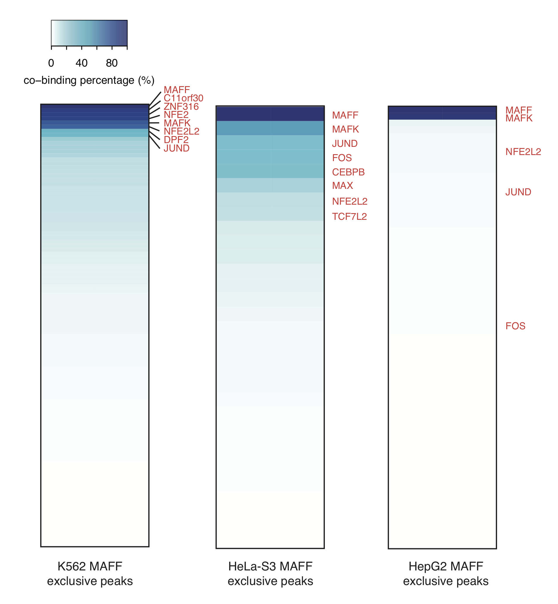
```

Interestingly, we observed several TFs co-binding with MAFF in MAFF cell specific loci in K562, not only incluing small maf protein MAFK, but also many Jun-related factors such as NFE2, NFE2L2 and JUND (Figure 11). However, in HepG2, only MAFK shows a high co-occupancy. We hypothesise the high enrichment of sequence TGA in the motif of K562 MAFF exclusive peaks is contributed by the Jun-related factors. To validate it, we further focused on the subset of K562 MAFF exclusive peaks which are bound by two very high co-binding Jun-related factors, NFE2 and NFE2L2, using `exclusivePeaks`.

```{r eval=FALSE}
# exclude the co-binding regions with NFE2 and NFE2L2 from K562 MAFF exclusive peaks 
# load K562 NFE2 and NFE2L2 peaks
K562_NFE2_peaks <- loadPeaks(id = "MM1_HSA_K562_NFE2")
#> Success: peak file has been returned in a data frame!
K562_NFE2L2_peaks <- loadPeaks(id = "MM1_HSA_K562_NFE2L2")
#> Success: peak file has been returned in a data frame!

K562_MAFF_exclPeaks_NoNFE_output <- exclusivePeaks(target_peak_list = list(K562_MAFF_exclusivePeaks), 
                                                   target_peak_id = c("MM1_HSA_K562_MAFF"), 
                                                   excluded_peak_list = list(K562_NFE2_peaks, 
                                                                             K562_NFE2L2_peaks), 
                                                   excluded_peak_id = c("MM1_HSA_K562_NFE2",
                                                                        "MM1_HSA_K562_NFE2L2"))
#> Start analysing: MM1_HSA_K562_MAFF... ...
#> ... ... Start analysing: MM1_HSA_K562_NFE2
#> ... ... Start analysing: MM1_HSA_K562_NFE2L2

# extract K562 MAFF exclusive peak subset, no overlapping with NFE2 or NFE2L2
K562_MAFF_exclPeaks_NoNFE_result <- exclusivePeakResult(exclusivePeaks = K562_MAFF_exclPeaks_NoNFE_output, 
                                                        return_exclusive_peak_sites = T, 
                                                        save_MethMotif_logo = T)
#> Start getting the results of exclusivePeaks ...
#> ... ... You chose to return exclusive peak sites;
#> ... ... You chose NOT to return exclusive peak summary;
#> ... ... ... Only list of exclusive peak sets will be returned in a list. Use names() in the output to see the ids of each peak set in the list.
#> ... ... You chose to save MethMotif logo in PDF if any;
#> ... ... ... You chose entropy logo;
#> ... ... ... You chose to show all methylation levels;
#> Success: a PDF named 'MM1_HSA_K562_MAFF_exclusive_peaks-logo-entropy.pdf' has been saved!
K562_MAFF_exclPeaks_NoNFE_peaks <- K562_MAFF_exclPeaks_NoNFE_result$MM1_HSA_K562_MAFF_exclusive_peaks
# number of K562 MAFF exclusive peak subset, no overlapping with NFE2 or NFE2L2
nrow(K562_MAFF_exclPeaks_NoNFE_peaks)
#> [1] 371

# profile co-binding factors in K562 MAFF exclusive peak subset, no overlapping with NFE2 or NFE2L2
K562_MAFF_excl_NoNFE_IPM_output <- intersectPeakMatrix(peak_list_x = list(K562_MAFF_exclPeaks_NoNFE_peaks), 
                                                       peak_list_y = K562_peaks_all, 
                                                       peak_id_x = c("MM1_HSA_K562_MAFF"), 
                                                       peak_id_y = K562_peaks_all_id)
#> Start analysing list x:MM1_HSA_K562_MAFF... ...
#> ... ... Start analysing list y:MM1_HSA_K562_AFF1
#> ... ... Start analysing list y:MM1_HSA_K562_ARID2
#> ... ... Start analysing list y:MM1_HSA_K562_ARID3A
#>           ... ...
#> ... ... Start analysing list y:MM1_HSA_K562_ZSCAN29
K562_MAFF_excl_NoNFE_IPM_result <- intersectPeakMatrixResult(intersectPeakMatrix = K562_MAFF_excl_NoNFE_IPM_output,
                                                             return_intersection_matrix = T, 
                                                             angle_of_matrix = "x")
#> Start getting the results of intersectPeakMatrix ...
#> ... ... You chose to return intersection matrix;
#> ... ... ... You chose x-wise intersection matrix;
#> ... ... You chose NOT to save MethMotif logo in PDF if any;

# heatmap for K562 MAFF exclusive peak subset, no overlapping with NFE2 or NFE2L2
K562_MAFF_excl_NoNFE_IPM_result_t <- as.data.frame(t(K562_MAFF_excl_NoNFE_IPM_result))
K562_MAFF_excl_NoNFE_IPM_result_order <- as.data.frame(K562_MAFF_excl_NoNFE_IPM_result_t[order(-K562_MAFF_excl_NoNFE_IPM_result_t$MM1_HSA_K562_MAFF),,drop = FALSE])
pdf("co-binding_heatmap_of_K562_MAFF_exclusive_loci_no_NFE2_or_NFE2L2.pdf")
heatmap.2(as.matrix(cbind(K562_MAFF_excl_NoNFE_IPM_result_order, K562_MAFF_excl_NoNFE_IPM_result_order)), col=color(100), trace = "none", Colv = NULL, Rowv = NULL,dendrogram = "none", density.info = "none",key.xlab = "co-binding percentage (%)", keysize = 1.2, cexRow = 0.4,  key.title = "", labCol = NA,  mar=c(2,25))
dev.off()
```

```{r echo=FALSE, fig.cap="Figure 12. TF co-binding profiles around K562 MAFF exclusive peaks excluded NFE2 and NFE2L2 peaks", out.width = '100%', fig.align="center"}
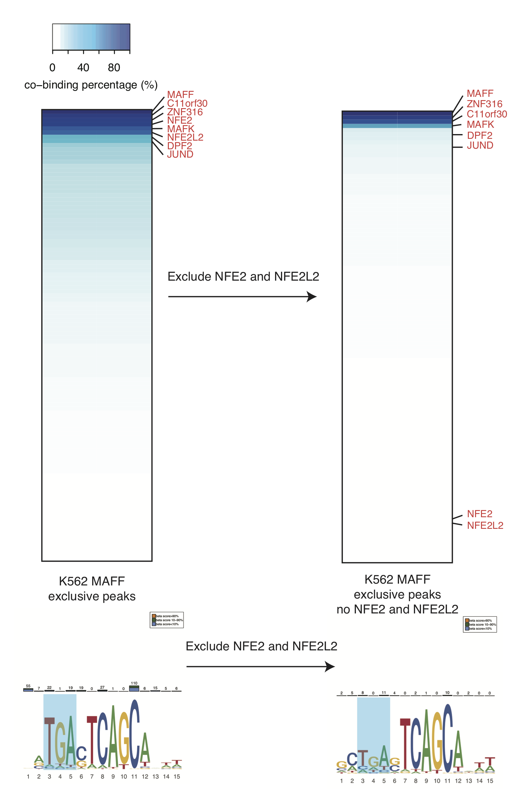
```

After removing co-binding regions with NFE2 and NFE2L2, a significant decrease in enrichment of sequence TGA in the motif of K562-specific MAFF binding sites (Figure 12). Indeed, the distinct MAFF co-binding partners result in the varied motifs enriched in MAFF peaks across different cell types. In addition, the DNA sequences can be hypermethylated in the HepG2 MAFF exclusive peaks, in which only small maf proteins are co-occupying, while the K562 specific MAFF binding loci are co-bound by many Jun-related factors and hypomethylated (Figure 9). Therefore, it is appealing to hypothesise that different DNA methylation levels in MAFF binding sites are associated with different binding partners.


